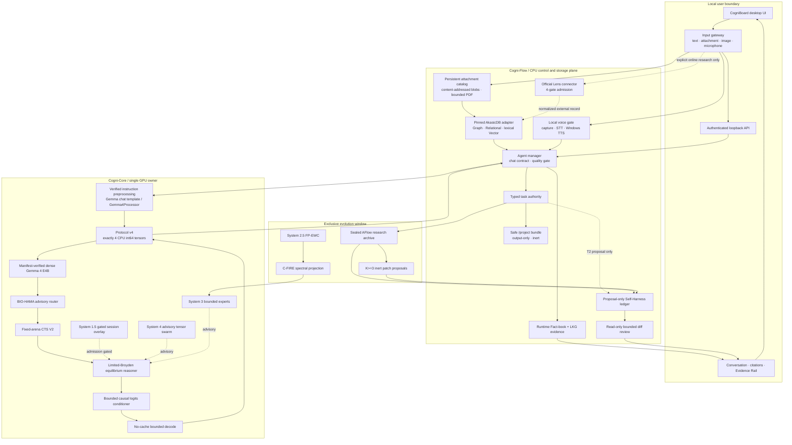
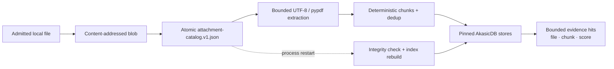
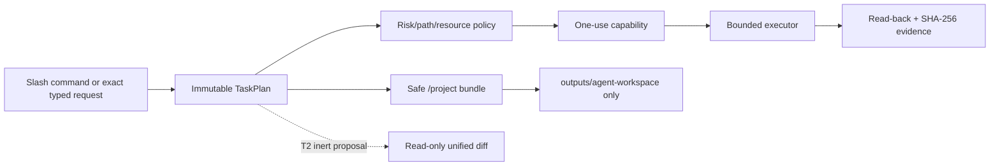
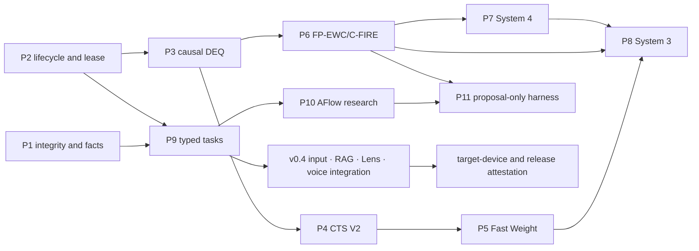

# Cogni-OS 2.0 v0.4.1 Working-Tree Architecture

## Scope and evidence boundary

This document describes the **v0.4.1 integration working tree**. It is not a
claim that a v0.4.1 executable or release bundle has been published. The
packaged application, README, and runtime version remain separate release
evidence until they are rebuilt from one frozen commit and smoke-tested.

The UI and runtime must keep these classes distinct:

1. **service readiness** — a process is alive and can accept a request;
2. **capability state** — `research`, `advisory`, `canary`, `authoritative`,
   `gated`, `night_only`, or `proposal_only`;
3. **evidence class** — `measured`, `verified`, `target`, or `plan`;
4. **execution mode** — local/air-gapped by default, or explicitly gated
   online research.

`RuntimeFactBook` and `CapabilityRegistry` describe authority.
`EvidenceRecordV1` binds a claim to exact model, code, configuration, and
device digests. A ready adapter is not proof of answer quality, GPU memory, an
external provider response, or a packaged release.

## System structure

Solid arrows are locally implemented data paths. Dotted arrows retain their
explicit gates; their existence is not authority to claim a live Lens result,
a trained expert, or an applied source patch.

## Instruction preprocessing and tensor IPC

### Text

- Production Gemma text turns are rendered with the verified local Gemma 4
  instruction contract and control tokens. A tokenizer without that contract
  fails closed; there is no plain `USER:`/`ASSISTANT:` transcript fallback.
- The final user turn receives a generation prompt. Continuation uses an
  explicit partial-assistant contract rather than replaying the whole answer.
- EOS/EOT and quarantined control tokens stop decode at token boundaries.

### Image, audio, and bounded video preprocessing

- `VerifiedGemma4MultimodalProcessor` verifies the closed local snapshot and
  then refuses production construction. The upstream path loader reopens names,
  so it cannot yet bind parser input to the exact bytes that were hashed; no
  `Gemma4Processor` is published while that ABA boundary remains unproven.
- Image and 16 kHz mono PCM-WAV inputs are decoded and bounded on the CPU, then
  passed through `Gemma4Processor.apply_chat_template` with typed image/audio
  content and `add_generation_prompt=True`.
- Raw media bytes, paths, PIL objects, NumPy arrays, strings, and JSON never
  cross the model-worker IPC boundary.
- Video admission is limited to an **already-decoded CPU frame** preprocessing
  boundary. It accepts no file path, URL, encoded container, decoder process, or
  network source and enforces frame/sampling/duration/pixel/byte/tensor bounds.
  It is not connected to protocol v4 or an answer-bearing model forward, and it
  records `actual_model_inference=false` and `vram_measured=false`.

### Protocol v4

Every text, image, or audio generation request crosses the process boundary as
**exactly four contiguous CPU `torch.int64` tensors**:

1. header — protocol/opcode, request/job/lease/deadline/decode/seed authority;
2. `input_ids`;
3. `attention_mask`;
4. control — modality, digests, stop tokens, bounded descriptors, and packed
   multimodal payload.

Logical image/audio tensors retain their declared dtype and shape through a
bounded, bit-preserving descriptor/packing contract and are reconstructed only
inside the worker. Responses are also exactly four CPU `int64` tensors. Media
content SHA-256 is bound into the session digest, and stale lease epochs,
deadline violations, shape/type mismatches, trailing payload, non-finite
features, and artifact changes fail closed.

A historical development checkout CPU-validated the local `Gemma4Processor` for
image/audio tensor construction. The current exact source instead disables the
unbound production path-loader. Current image/audio/video contracts are tested
with explicitly admitted test processors only; they prove neither real-processor
compatibility nor integrated answer quality, latency, or VRAM compliance.

## Conversation and inference path

1. The controller validates the Fact-book and acquires an inference lease.
2. The bounded chat history is rendered with the verified instruction
   template; an optional admitted image or audio bundle uses the same resident
   model service and session authority.
3. The Gemma feature state feeds BIO-HAMA and `SearchRequestV2`.
4. CTS uses a fixed 301-node arena, rank-16 limited solver history, bounded
   retrieval, separate policy/critic surfaces, and an explicit MAC budget.
   Search depth never sizes an arena tensor.
5. Unsafe or non-finite transition edges produce explicit failure telemetry
   and zero-value backup; silent fallback is not accepted.
6. A converged terminal latent produces a bounded causal logits bias. Base
   Gemma weights remain frozen. This remains a `canary`, not a trained-quality
   claim.
7. System 4 and System 3 remain detached `advisory` telemetry. System 1.5 is
   admitted only with a trained checkpoint plus AQ/OOD/session gates; no such
   authoritative product artifact is supplied by default.
8. Decode runs with `use_cache=False`. Repetition, role leakage, false
   identity, control-token leakage, and incomplete output are checked before a
   turn is committed.
9. The lease and session-scoped activation are released on success,
   cancellation, timeout, or error.

## Persistent attachment, PDF, and AkasicDB path

- Attachment admission validates name, suffix, MIME/signature, size, count,
  path, and aggregate quota. Blobs are stored below the project output root.
- The catalog and indexed-document set are persisted atomically. Startup
  verifies catalog entries and blob digests, then reconstructs the process
  memory index. List, preview, delete, and reindex APIs are authenticated and
  bounded.
- PDF extraction is local and bounded by file bytes, page count, and extracted
  characters. Encrypted, malformed, oversized, or textless PDFs fail closed.
  Physical-page provenance, normalized page-relative character offsets, parser
  timeout/reap behavior, and a generated adversarial corpus are implemented and
  covered by CPU tests. They remain `IMPLEMENTED_UNVERIFIED` until exact-scope
  release evidence is independently attested.
- The AkasicDB adapter pins the audited upstream revision and invokes its
  GraphStore, RelationalStore, and VectorStore interfaces. The stores are
  process-memory and are rebuilt from the persistent catalog.
- Current answer-bearing retrieval is a stable SHA-256 lexical sketch with
  lexical overlap enforcement. An optional manifest-bound, CPU-only mean-pool
  semantic artifact verifier and test-only CPU mean-pool boundary now validate a
  closed-world layout. Its production path-loader is disabled until parsed bytes
  can be bound to the verified snapshot, and it reports
  `quality_attested=false`, `answer_bearing=false`, and `production_ready=false`.
  No semantic model artifact or independent quality, license, poisoning, or
  relevance attestation is bundled, so normal RAG remains lexical.
- Evidence identifies file, chunk, score, physical PDF page, normalized
  page-relative offsets, and excerpt digest. Inline sentence citations and the
  source list open an independent read-only drawer. The schema explicitly calls
  its text a normalized extracted excerpt; it is never presented as raw PDF or
  attachment bytes.

## Opt-in official research connectors

Lens access uses fixed official HTTPS POST endpoints and never HTML
scraping, browser automation, redirects, or arbitrary URLs. A request is
admitted only when all four gates pass:

1. `COGNI_OS_ONLINE_MODE=1`;
2. `api.lens.org` is in `COGNI_OS_WEB_ALLOWLIST`;
3. `COGNI_OS_LENS_API_TOKEN` is configured;
4. `COGNI_OS_LENS_TERMS_ACCEPTED=1`.

The connector bounds query length, result count, response bytes, timeout,
retries, and concurrency. It normalizes patent/scholarly records, redacts the
Bearer token, records endpoint/domain/retrieval time/query SHA-256/source-record
SHA-256, and can pass normalized evidence to the AkasicDB adapter.

Only mocked transport and local contract tests have passed. No approved token,
terms/account confirmation, or live Lens response was available for this
working tree, so patent search, scholarly search, and live Lens-to-AkasicDB
indexing remain **external blockers**, not completed product evidence.

The separate general-search boundary targets only Brave's official JSON GET
endpoint at `api.search.brave.com/res/v1/web/search`. It is disabled by default
and requires operator online mode, the exact provider and host allowlist, a
bounded environment token, accepted terms, and per-request user opt-in. It does
not follow redirects, scrape HTML, or fetch returned result URLs; response
records carry retrieval time and query/source digests. The implementation and
mocked transport tests do not prove a live subscription, result quality,
availability, or egress audit.

## Model-switch control boundary

`cogni_demo.model_switch` contains a disabled-by-default control-plane state
machine for admission close, bounded drain, exact unload acknowledgement,
injected memory-release proof, candidate health, atomic publication, rollback,
and safe mode. It has no concrete resident supervisor/factory/memory probe wired
into the product server, and the UI therefore keeps discovered alternate models
non-selectable. CPU unit evidence for this primitive is not proof of a real
GPU/model unload, zero-VRAM postcondition, or production model switch.
The exact cooperative-only and crash-recovery limits are recorded in
`docs/MODEL_SWITCH_CONTROL_SAFETY_KO.md`.

## Voice capture, STT, and TTS gates

- Browser microphone capture begins only after a user action. Permission
  denial/no-device states, stop/cancel, a 30-second cap, local 16 kHz mono WAV
  conversion, and authenticated loopback transport are implemented.
- `Gemma4ModelSpeechTranscriber` can reuse the single resident,
  manifest-bound model service; it cannot load a second model. Silence and
  malformed transcripts fail closed.
- `WindowsSpeechSynthesizer` uses installed `System.Speech` voices through a
  fixed noninteractive PowerShell command, returns a bounded WAV, and reports
  zero external calls. The UI can play and stop the latest completed reply only
  when the runtime probe enables the capability.
- Capability display separates capture transport, processor, STT, and TTS. A
  missing or failed component remains disabled with a stable reason.

One real Korean Windows TTS-to-the-same-manifest-bound-Gemma STT validation
passed with an exact transcript, normalized similarity 1.0, 5.0187 seconds at
16 kHz, and `external_calls=0`. This single synthetic round trip does not
replace a WER corpus, noisy/multi-speaker testing, real browser microphone E2E,
packet capture, or target-device VRAM evidence. End-to-end voice therefore
remains a guarded partial capability rather than a general STT-quality claim.

## Local task, safe project bundle, and proposal review

- T0 is bounded read/list/search/status. T1 is fixed pytest and output-only
  artifact creation. T2 may stage an inert proposal. T3, arbitrary shell,
  general network, security/evaluator mutation, and unrestricted paths are
  denied. Free-form model output is never execution authority.
- The safe `/project` bundle accepts an exact typed JSON schema, 1–12
  allowlisted UTF-8 files, and at most 256 KiB aggregate content. Python and
  JSON receive syntax validation. A private stage is atomically committed with
  no overwrite under `outputs/agent-workspace`, followed by manifest and
  SHA-256 read-back verification.
- A project bundle is inert: it does not execute generated code, run its own
  tests, mutate source, or use the network.
- Proposal review exposes at most eight bounded, digest-bound unified diffs.
  Stale base content suppresses the diff. The endpoint has no execution,
  approval, mutation, apply, promotion, or rollback authority.

## Evolution and promotion boundary

System 2.5, System 3 candidate work, AFlow, and Self-Harness are allowed only in
an exclusive evolution window.

- FP-EWC uses bounded empirical Fisher state and a generation transaction;
  C-FIRE reprojects updates and restored checkpoints below the configured
  spectral margin.
- System 3 uses a bounded preallocated expert pool and remains `advisory`
  without an independently admitted trained artifact.
- AFlow uses sealed operators/evaluator/policy/suite and emits
  `research_archive_only` records.
- Self-Harness records evidence and may construct inert proposals after the
  required causal support. The shipped UI and default profile remain
  proposal-only with read-only review and no approve/apply endpoint.
- The internal Linux `PromotionMode.ATTESTED` path copies a bounded
  regular-file snapshot, evaluates one exact replacement with an evidence-bound
  OCI runner, persists immutable evaluation evidence, and returns to inference
  while it waits for external Ed25519 authority. A fresh drain/checkpoint is
  required for one atomic promotion or one signed committed rollback.
- The named-engine/image CPU integration smoke is not independent production
  isolation evidence. Rootful daemon, runtime, kernel, user namespace,
  seccomp/AppArmor, socket ownership and hostile-code escape boundaries remain
  unverified. An operator-only append-only validator covers the
  promotion/health/separately signed rollback evidence-chain contract, but no
  independent production-runner statement or current raw production E2E
  evidence has been accepted.

This internal path is never automatic self-modification and does not change the
Runtime Fact-book or desktop UI from `proposal_only`.

## Memory and hardware claims

The implementation claims a bounded **solver history and active CTS working
set** for fixed batch, width, hidden size, solver rank, and arena capacity.
`max_depth` does not allocate CTS tensors. This is not constant total memory
for model weights, CUDA reserves, checkpoints, conversation history, RAG data,
or logs.

The 16.7 GiB threshold is an admission/postcondition guard. Existing
measurements on a different GPU do not certify the target RTX 4090. The new
image/audio IPC, real-model forward, latency, and peak VRAM must be measured on
the exact frozen build and target device before release claims are promoted.

## Phase dependencies

## Reference lineage

The implementation was compared with the owner's public CTS, System 1.5,
System 2.5, System 3/3.5, System 4/5, BIO-HAMA, and AkasicDB repositories.
Runtime code does not import from review checkouts under `work/upstream`. See
[`UPSTREAM_AUDIT.md`](UPSTREAM_AUDIT.md).
