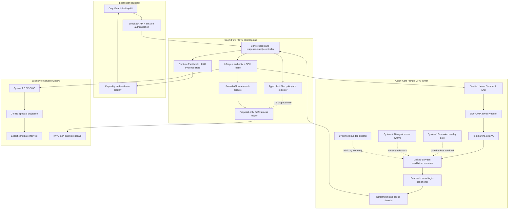
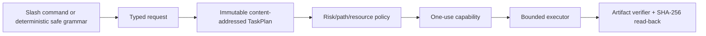
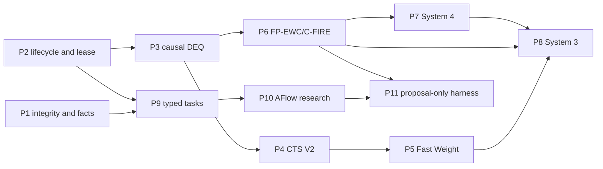

# Cogni-OS 2.0 v0.3.1 Architecture

## Authority and evidence first

The architecture separates three facts that the UI must not conflate:

1. **service readiness** — a process is alive and can accept a request;
2. **capability state** — `research`, `advisory`, `canary`, `authoritative`,
   `gated`, `night_only`, or `proposal_only`;
3. **evidence class** — `measured`, `verified`, `target`, or `plan`.

`RuntimeFactBook` and `CapabilityRegistry` describe authority. `EvidenceRecordV1`
binds a claim to exact model, code, configuration and device digests. The
external `FactBookSnapshotStore` accepts only valid content-addressed records,
selects one snapshot through an atomic last-known-good pointer, and rejects
evidence when its scope becomes stale.

## System structure

Solid arrows are active product flow. Dotted arrows retain the capability
state written on the edge; the existence of an edge is not answer authority.

## Process and IPC boundary

- Cogni-Flow owns HTTP/UI state, conversations, typed tasks, evidence, logs and
  proposal records. It does not own a CUDA model.
- One spawned Cogni-Core worker loads the manifest-verified model and is the
  only CUDA owner.
- Model IPC v3 carries bounded CPU tensors. Every request binds the operation
  to a job id, lease epoch, request/lease deadline, artifact digest, and session
  digest. Stale epochs, late frames, artifact mismatch and cross-session frames
  fail closed.
- PAUSE/RESUME align the worker with the day/night state machine. A night
  transition first blocks admission, drains work, releases the lease, and then
  checkpoints.
- Natural language, paths, source code and JSON remain in Cogni-Flow. They do
  not enter the high-speed tensor data plane.

## Inference path

1. The controller validates the current Fact-book and acquires an inference
   lease.
2. A bounded conversation is rendered with the local Gemma 4 turn contract.
3. The verified Gemma feature state feeds BIO-HAMA and SearchRequestV2.
4. CTS uses a fixed 301-node arena, rank-16 limited solver history, bounded
   semantic retrieval, separate policy/critic surfaces, and an explicit MAC
   budget. Search depth never sizes an arena tensor.
5. Unsafe/non-finite transition edges produce explicit failure telemetry and
   zero-value backup; silent fallback is not accepted.
6. A converged terminal latent produces a bounded causal logits bias. The base
   Gemma weights remain frozen. This path is `canary`, not a trained-quality
   claim.
7. System 4 and System 3 run with session isolation, but remain detached
   `advisory` telemetry. System 1.5 is used only when a trained checkpoint and
   AQ/OOD/session admission gates all succeed; no such product artifact is
   supplied by default.
8. Decode runs with `use_cache=False`. EOS/EOT/control markers stop at token
   boundaries. Repetition, role leakage, false identity, and incomplete output
   are checked before a turn is committed.
9. The lease and all session-scoped activation are released on completion,
   cancellation, timeout, or error.

## Local task path

- T0 is bounded read/list/search/status.
- T1 is fixed pytest and output-only artifact creation.
- T2 can stage an inert Self-Harness proposal but cannot mutate source.
- T3, arbitrary shell, network, security/evaluator mutation and unrestricted
  paths are permanently denied.
- Free-form Gemma output is never execution authority.

## Evolution and research path

System 2.5, System 3 candidate work, AFlow, and Self-Harness are allowed only in
an exclusive evolution window.

- FP-EWC uses bounded empirical Fisher state and a generation transaction.
  C-FIRE reprojects updates and restored checkpoints below the configured
  spectral margin.
- The System 3 lifecycle operates on an eight-slot preallocated pool and
  orders calibration, candidate selection, C-FIRE, isolated candidate
  training, held-out checks, routed Fisher, canary and independent authority.
  No verified trained expert artifact ships with v0.3.1, so the product state
  remains `advisory`.
- AFlow accepts only six typed operators, a sealed evaluator/policy/suite,
  bounded DAGs and budgets, repeated held-in/out metrics, and single-parent
  lineage. Its sole output is `research_archive_only`.
- Self-Harness persists both success and failure evidence, forms exact causal
  signatures, requires at least three distinct candidates per signature, and
  links every proposal to primary evidence. Stale hashes, forbidden AST,
  immutable-surface changes and path escapes are rejected. Rejected
  replacements enter a negative archive.
- The production assembly hashes mutable source before and after a night
  proposal cycle. Any change enters safe mode. There is no v0.3.1 install or
  promotion path.

Phase 12 attested sandbox and safe promotion are deliberately outside the
Phase 1–11 release boundary. Prior promotion primitives are not product
authority and must not be presented as automatic self-modification.

## Memory claim

The implementation claims a bounded **solver history and active search working
set** for fixed batch, width, hidden size, solver rank and arena capacity.
`max_depth` does not allocate CTS tensors. It does not claim constant total
memory for model weights, CUDA allocator reserves, expert/checkpoint banks,
conversation history, logs or external data.

The 16.7 GiB limit is an admission and postcondition guard. A current canary
measurement on the attached RTX 5090 Laptop GPU does not certify the target RTX
4090; allocator and kernel workspaces must be measured again on that device.

## Phase dependencies

## Reference lineage

The implementation was compared with the owner's public CTS, System 1.5,
System 2.5, System 3/3.5, System 4/5, and BIO-HAMA repositories. Runtime code
does not import from the review checkouts under `work/upstream`. See
[`UPSTREAM_AUDIT.md`](UPSTREAM_AUDIT.md).
