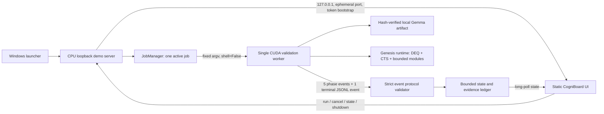

# CogniBoard 사업 성공 및 3분 심사 데모 계획

문서 상태: 실행 기준안 1.0  
작성 기준일: 2026-07-11  
적용 대상: Cogni-OS 2.0 Genesis / CogniBoard  
원문 근거: `Cogni-OS_PSSD_사업계획서_무결성반영본.pdf` 물리 페이지 1-3  

> 이 문서는 사업계획서의 주장을 더 크게 만드는 문서가 아니다. 현재 구현과
> 증거가 허용하는 범위 안에서 고객 가치, 기술 검증, 심사 메시지를 하나로
> 정렬하는 운영 기준이다. PDF 페이지 표기는 인쇄 페이지 번호가 아니라 PDF의
> 물리 페이지를 뜻한다.

## 0. 경영진 결론

Cogni-OS가 이겨야 할 시장은 "AI가 더 똑똑한가"를 구매하는 시장이 아니라,
**민감 데이터를 외부로 보낼 수 없는 조직이 검증 가능한 로컬 AI 운영 결과를
구매하는 시장**이다.

현재 가장 설득력 있는 제품 정의는 다음과 같다.

> Cogni-OS는 민감 연구 데이터와 모델을 외부로 보내지 않고, 한 대의 로컬 GPU에서
> 고정 용량 추론 작업공간과 감사 가능한 안전 게이트를 제공하는 폐쇄망 AI
> 런타임 어플라이언스다.

사업 성공을 위해 즉시 고정해야 할 의사결정은 다섯 가지다.

1. **상업 비치헤드는 민간 바이오·신약 R&D로 좁힌다.** 실제 국방 LOI 또는
   납품 SI가 없는 상태에서 지휘통제실을 첫 고객으로 삼으면 조달 기간과 안전성
   책임 때문에 고객 증명이 늦어진다. 국방은 폐쇄망 정비문서·기술문서 지원부터
   시작하는 전략 확장 시장으로 둔다.
2. **"PC 한 대"가 아니라 "범용 GPU + 검증된 경계 + 폐쇄망 운영"으로
   차별화한다.** 데스크톱 로컬 AI 자체는 이미 경쟁 제품이 제공한다.
3. **O(1)은 전체 시스템 주장이 아니다.** 고정 hidden size, solver history,
   node capacity 조건에서 reasoning depth와 독립적인 CTS/DEQ working set이라고
   정의한다.
4. **모든 숫자는 실측·검증·목표·계획 중 하나로 분류한다.** 등급이 없는 숫자는
   발표 화면에 올리지 않는다.
5. **3분 데모의 주인공은 3D 효과가 아니라 증거의 상태 변화다.** 내부 실측
   스냅샷이 라이브 worker 결과로 교체되고, 잘못된 이벤트는 fail-closed 되는
   장면이 핵심이다.

### 권장 고객과 구매 논리

| 구분 | 권장 정의 |
|---|---|
| 첫 사용자 | 기밀 연구문서·코드·실험자료를 다루는 바이오/신약 R&D 연구자 |
| 경제적 구매자 | R&D 본부장, CIO 또는 연구소장 |
| 도입 차단자 | CISO, 법무/IP 책임자, IT 운영 책임자 |
| 첫 Job-to-be-Done | 기밀 문서와 연구 코드를 외부 반출 없이 검색·요약·근거 합성 |
| 구매 이유 | 데이터 비반출, 설치·운영 단순화, 측정 가능한 GPU 경계, 감사 로그 |
| 비교 기준 | 퍼블릭 클라우드, DIY 오픈소스, 엔터프라이즈 온프레미스, 데스크톱 AI 장비 |
| 첫 계약 | 유상 8-12주 PoC 후 어플라이언스·연간 라이선스로 전환 |

PDF는 공공·국방을 1차 타깃, 바이오·신약과 금융을 2차 타깃으로 제시한다
(PDF p.1). 이는 장기 시장 우선순위로는 유효하지만, 첫 90일의 고객 검증
우선순위와는 구분해야 한다. 실제 국방 LOI, 보안 담당자 인터뷰, 납품 SI가 이미
있다면 국방을 유지할 수 있다. 이 경우에도 첫 사용사례는 자동 지휘결정이 아니라
정비 매뉴얼, 기술문서, 코드 분석처럼 비안전결정형 업무로 제한한다.

금융 "폭락장 대응"은 현재 비치헤드에서 제외한다. 내부 텐서 결합 지연시간은
시장 데이터 수집, 모델 추론, 위험통제, 주문 실행을 포함한 end-to-end 금융
의사결정 시간이 아니기 때문이다(PDF p.2).

## 1. 시장 포지셔닝과 경쟁

### 1.1 한 문장 포지셔닝

> 기밀 데이터를 클라우드에 올릴 수 없는 바이오 R&D 조직을 위해, Cogni-OS는
> 검증된 로컬 모델 artifact와 bounded reasoning working set, day/night 안전
> 제어를 한 제품으로 제공하는 폐쇄망 AI 어플라이언스다. 클라우드나 DIY 구축과
> 달리 고객은 모델 파일이 아니라 설치·보안·검증·복구가 포함된 운영 결과를 산다.

### 1.2 고객 문제를 증명하는 순서

PDF는 데이터 유출 우려, KV-cache 메모리 병목, 온프레미스 구축비를 고객 문제로
제시한다(PDF p.1). 발표에서는 이를 다음 네 질문에 대한 고객 증거로 바꿔야 한다.

1. 어떤 데이터가 어떤 규정 또는 계약 때문에 외부로 나갈 수 없는가?
2. 고객은 지금 어떤 대체재를 사용하고 있으며 연간 비용은 얼마인가?
3. 현재 업무에서 메모리·지연·운영인력 문제로 실제 중단되는 작업은 무엇인가?
4. 이 문제를 해결하면 단축되는 시간, 절감되는 비용, 감소하는 보안 위험은 얼마인가?

"국가/기업의 존폐", "수백 대 GPU가 필요하다", "AI 도입을 포기한다"는 표현은
출처가 없는 한 사용하지 않는다. 인터뷰 인용, 현재 견적, 보안 규정, PoC baseline로
대체한다.

### 1.3 경쟁 구도

PDF는 퍼블릭 클라우드와 자체 구축 오픈소스를 대체재로 든다(PDF p.1, p.3).
실제 비교표에는 다음 네 경쟁군이 모두 있어야 한다.

| 경쟁군 | 고객이 선택하는 이유 | Cogni-OS 승리 조건 | 필요한 증거 |
|---|---|---|---|
| 퍼블릭 클라우드 AI | 최신 모델, 즉시 확장, 풍부한 API | 데이터 비반출과 예측 가능한 비용 | egress 0 측정, 3년 TCO |
| DIY 오픈소스 | 낮은 라이선스 비용, 높은 유연성 | 설치·보안·업데이트·복구를 제품화 | 설치시간, 관리자 시간, 장애복구 |
| 엔터프라이즈 온프레미스 | 지원, 인증 생태계, 대규모 운영 | 더 작은 설치 면적과 낮은 복잡도 | 동일 업무의 비용·운영 비교 |
| 데스크톱 AI 어플라이언스 | 한 대의 장비에서 로컬 모델 실행 | 범용 RTX 비용과 bounded working set | 동급 태스크·품질·전력·가격 비교 |

NVIDIA DGX Spark는 공식적으로 128GB 통합 메모리와 데스크톱 로컬 모델 실행을
제공한다. 따라서 "한 대의 PC" 자체를 독점적 차별성으로 말하면 안 된다.
[NVIDIA DGX Spark 공식 하드웨어 사양](https://docs.nvidia.com/dgx/dgx-spark/hardware.html)

Red Hat OpenShift AI Self-Managed도 온프레미스와 disconnected 환경 배포를
지원한다. Cogni-OS는 엔터프라이즈 플랫폼 전체와 기능 수로 경쟁하지 말고, 단일
업무의 설치·운영 단순성과 범용 GPU 비용으로 경쟁해야 한다.
[Red Hat OpenShift AI disconnected 배포 문서](https://docs.redhat.com/en/documentation/red_hat_openshift_ai_self-managed/2.16/html/installing_and_uninstalling_openshift_ai_self-managed/installing-and-deploying-openshift-ai_install)

### 1.4 권장 수익모델

PDF의 "Appliance 일시 매출 + 플러그인 SaaS 월 구독" 구조(PDF p.2)는 다음과
같이 수정한다.

1. 유상 진단·PoC
2. 어플라이언스 판매 또는 리스
3. 연간 온프레미스 소프트웨어 라이선스와 유지보수
4. 전자서명된 오프라인 산업 모듈 팩
5. 현장 설치, 보안 업데이트, 장애복구 SLA

완전 폐쇄망 제품에 "SaaS"를 쓰려면 실제 서비스 제공 구조와 연결·과금·업데이트
방식을 설명해야 한다. 그렇지 않으면 "연간 오프라인 라이선스 및 모듈 구독"이
정확하다.

CSAP는 클라우드서비스 제공자가 제공하는 클라우드컴퓨팅서비스를 위한 제도다.
순수 어플라이언스만 판매한다면 CSAP가 우선 인증인지 별도 검토가 필요하다.
[KISA CSAP 제도 소개](https://isms.kisa.or.kr/main/csap/intro/index.jsp)

## 2. PDF 무결성 수정표

아래 항목은 발표 전 반드시 PDF, CogniBoard, IR 대본에서 같은 문구로 통일한다.

| 주제 | PDF 현재 표현과 근거 | 무결성 문제 | 외부 공개용 수정 문구 | 통과 증거 | UI 등급 |
|---|---|---|---|---|---|
| RTX 4090/5090 | "RTX 4090 1대에서 내부 실증 완료"(p.2) | 저장소의 현재 실측은 RTX 5090 Laptop GPU다. README와 `docs/GEMMA4.md`도 4090 재검증 필요를 명시한다. | "현재 RTX 5090 Laptop에서 실측했으며 RTX 4090 24GB는 반복 검증 대상이다." | 4090 동일 artifact/config 30회 원본 로그 | 현재: 실측 / 4090: 목표 |
| Peak VRAM | p.2는 장비 적합성만 주장 | 과거 UI의 고정 VRAM 숫자는 현재 code/config/device scope가 바뀌면 stale이다. | 숫자를 하드코딩하지 않고 현재 EvidenceRecord의 측정 구간·scope와 함께 공개 | CUDA allocated/reserved 시계열, artifact/config/device digest | 실측 |
| Context vs depth | p.1은 context 증가의 KV-cache 문제, p.2는 DEQ depth 고정 메모리로 해결 | 서로 다른 독립변수다. depth 불변성은 context 불변성을 증명하지 않는다. | "reasoning depth working set과 context-length memory를 별도 실험한다." | context 1k/2k/4k/8k와 depth 8/64/100의 2축 표 | 검증 전 |
| O(1) 범위 | "메모리 증가가 없는 O(1) 코어", "깊어져도 O(1)"(p.1-2) | 모델 가중치, 입력, expert bank, 로그까지 포함한 total memory O(1)로 읽힌다. | "고정 hidden/history/node capacity에서 depth-independent CTS/DEQ working set" | requested depth가 바뀌어도 preallocation byte가 동일하고 peak 허용량 이내 | 검증 |
| KV cache | p.1에서 KV-cache Wall을 핵심 문제로 제시 | `use_cache=False` 구성은 확인 가능하지만, attention/context 메모리까지 고정한다는 뜻은 아니다. | "생성 KV cache를 비활성화한 검증 경로이며 context 메모리는 별도 공개" | 구성 덤프와 context-length profile | 검증 |
| 6.3ms | "System 4 내부 설계 목표 6.3ms", 금융 긴급상황 대응(p.2), 무결성 노트에서 목표 재확인(p.3) | tensor 결합 microbenchmark와 end-to-end 응답을 혼동할 위험 | "동일 장비·shape의 tensor-combine p95 목표 6.3ms. end-to-end TTFT는 별도 측정." | warm-up, 반복 수, shape, dtype, p50/p95/p99 | 목표 |
| 약 1,000대 | 국방 망분리 부대 기준 추산(p.1-3) | 사이트 목록, 단위당 수량, 기간, 접근 가능률, 수주율이 없다. SOM이 아니라 출처 미확보 opportunity다. | "3년 SOM은 명명 계정 × 계정당 수량 × 접근 가능률 × 수주율로 산정 중" | 출처표, named-account funnel, LOI | 계획 |
| SaaS | 산업 플러그인 월 구독(p.2) | air-gap과 지속 연결형 SaaS의 운영모델이 충돌 | "연간 온프레미스 라이선스 + 서명된 오프라인 모듈 팩" | 가격 인터뷰, 업데이트·라이선스 절차 | 계획 |
| CSAP | 2년 차 준비(p.3) | 클라우드서비스가 없으면 인증 대상·효용이 불명확 | "클라우드 서비스 출시 시 CSAP 적용성 검토. 어플라이언스 인증경로는 별도 확정." | KISA/전문기관 scope memo | 계획 |
| ISO/IEC 42001 | 조달 우위와 카피캣 원천 차단(p.2-3) | 조직의 AI 경영시스템 표준이지 제품 성능 인증이나 독점권이 아니다. | "AI 거버넌스와 운영 신뢰를 높이는 관리체계" | 인증 범위, 일정, 견적 | 계획 |
| 초거대 AI | 한 PC에서 초거대 AI 구동(p.1) | 현재 검증 artifact의 범위를 넘어선 포괄 주장 | "hash-verified local Gemma artifact의 bounded runtime 검증" | 모델명, hash, weight byte, 환경 | 실측 |
| AI 운영체제 | 제품명 전반(p.1-3) | 커널·드라이버·OS 보안 경계가 없다면 일반 운영체제로 오인 | "폐쇄망 AI 런타임 어플라이언스"를 제품 카테고리로 병기 | 실제 관리 범위 목록 | 검증 |
| CogniBoard 의사결정 궤적 | 3D로 보고 직접 수정(p.2) | 숨겨진 모델 사고과정을 사실처럼 노출한다는 인상을 줌 | "검색 상태, solver 잔차, 도구 호출, 감사 이벤트를 시각화" | 화면 필드와 원본 event mapping | 검증 |
| 자율 진화 | 등록특허와 야간 자율학습(p.2) | v0.3.2는 증거 기반 proposal-only이며 source 실행·설치·승격 권한이 없다. | "야간에 성공·실패 증거와 K≥3 후보를 축적하되 현재 source는 변경하지 않는 연구 제어면" | Phase 12 독립 격리·승격 검증 전 mutation 0 | 검증/계획 |
| 최종본 완성도 | 도식 1·2, 사진 1, SOM·비용 별첨이 모두 예정(p.1-3) | PDF에는 내장 이미지가 없으며 "최종본"과 충돌 | 실제 캡처, memory graph, evidence ledger로 교체 | 첨부 원본과 출처 | 계획 완료 후 검증 |

ISO/IEC 42001은 조직이 AI 경영시스템을 수립·운영·개선하기 위한 표준이다.
제품 성능 인증으로 표현하지 않는다.
[ISO/IEC 42001 공식 설명](https://www.iso.org/standard/42001)

### 금지 표현과 권장 표현

| 금지 | 권장 |
|---|---|
| KV-cache는 모든 Transformer의 치명적 결함이다 | 장문 생성에서 KV-cache는 주요 메모리 병목이 될 수 있다 |
| 무조건 O(1) 메모리다 | 고정 capacity에서 depth-independent working set을 검증했다 |
| 4090에서 이미 증명했다 | 5090 Laptop에서 실측했고 4090은 반복시험 대상이다 |
| 금융 폭락장에 6.3ms로 대응한다 | tensor-combine p95 6.3ms를 목표로 하며 end-to-end는 별도다 |
| 1,000대 시장을 확보한다 | 약 1,000대 가설을 named-account funnel로 검증한다 |
| ISO가 카피캣을 원천 차단한다 | ISO는 운영 신뢰와 거버넌스 준비도를 높인다 |
| 대기업도 따라올 수 없다 | 같은 조건에서 재현 가능한 차이를 공개한다 |
| AI의 사고과정을 보여준다 | 감사 가능한 실행 상태와 근거 이벤트를 보여준다 |
| 스스로 코드를 고쳐 무한 진화한다 | 격리·회귀·승격 게이트를 통과한 제한적 변경 연구다 |

## 3. CogniBoard 정보구조

### 3.1 정보설계 원칙

1. **15초 안에 가치와 증거 범위를 전달한다.** 고객 문제, 실제 장비, 현재 증거
   등급이 첫 화면에서 보인다.
2. **실측과 목표를 색뿐 아니라 텍스트로 구분한다.** 색각 이상과 화면 캡처에서도
   구분돼야 한다.
3. **모든 숫자는 source와 measured_at으로 추적 가능해야 한다.** 정적 숫자는
   "내부 실측 스냅샷"이고 현재 실행 결과가 아니다.
4. **실패는 숨기지 않는다.** protocol failure, timeout, VRAM 초과, 비수렴은
   성공 화면으로 변환하지 않는다.
5. **사업 화면도 evidence ledger를 따른다.** 시장·인증·특허는 기술 PASS와 같은
   모양으로 표시하지 않는다.

### 3.2 전역 프레임

| 영역 | 표시 정보 | 목적 |
|---|---|---|
| 상단 Trust Bar | LOCAL ONLY, 실제/목표 장치, inference/evolution, runtime 상태 | 환경과 실행상태를 즉시 고정 |
| 좌측 Navigation | Mission, Live Validation, Architecture, Business, Evidence | 3분 대본 순서와 동일하게 구성 |
| 우측 Evidence Rail | artifact, source, measured_at, 현재 장치, 증거 등급 | 어떤 화면에서도 주장 출처 확인 |
| 3분 IR Mode | 6개 guided step, 이전/다음/종료 | 발표자의 설명 순서 표준화 |
| Audit/Log Drawer | bounded event와 실패 코드 | 기술 심사 질문에 즉시 대응 |

### 3.3 다섯 개 핵심 화면

| 화면 | 첫 질문 | 반드시 보일 정보 | 제거·수정할 위험 |
|---|---|---|---|
| Mission Control | 왜 지금 이 제품인가? | 데이터 비반출 가치, 실제 5090/목표 4090 분리, VRAM·depth·잔차 | "초거대", 무조건 O(1), 하드코딩된 LIVE 인상 |
| Live Validation | 지금 실제로 무엇을 실행하는가? | verify → load → build → infer → postcheck → result, worker source | 스냅샷을 라이브 결과처럼 표시 |
| Architecture | 왜 안전하고 방어 가능한가? | CPU 제어면, 단일 CUDA owner, day/night, bounded protocol | live JSONL과 4-tensor 경계를 같은 경로처럼 표현 |
| Business | 누가 왜 돈을 내는가? | 바이오 R&D 첫 use case, buyer map, paid PoC → appliance → annual license | 1,000대 확정, 금융 6.3ms, 근거 없는 비교 우위 |
| Evidence | 무엇이 사실이고 무엇이 다음 목표인가? | 4등급 ledger, source, next gate, 30/60/90일 | 특허·ISO·SOM을 PASS처럼 표시 |

### 3.4 현재 구현에 대한 UI 무결성 주의

- UI의 VRAM, depth, test status는 **현재 EvidenceRecord와 scope가 연결된 경우에만**
  실측 또는 검증이다. 새 라이브 실행 전에는 `LIVE`가 아니라 `SNAPSHOT`으로 읽힌다.
- live worker terminal metrics에는 회귀 test count가 없다. 테스트 개수는 release
  계약이 아니며, UI에는 source digest와 최종 suite PASS/FAIL만 별도 검증으로 표시한다.
- UI의 `Network BLOCKED`는 offline 환경변수와 구성 정책의 증거다. 별도 packet
  capture 또는 firewall audit가 없다면 "egress 0 실측"으로 표시하지 않는다.
- VRAM 숫자에는 `allocated/reserved`, 측정 구간, artifact/config/device digest를
  함께 붙인다. 다른 run의 model-load와 integrated peak를 한 카드에 섞지 않는다.
- `System 4 6.3ms`, `SOM 약 1,000대`, ISO·CSAP는 목표 또는 계획이다.
- P-S-S-D story의 D는 PDF의 Development와 일치시킨다. Defense 또는 독점 방어와
  혼용하지 않는다.

## 4. 3분 심사 대본

### 4.1 운영 전제

- 브라우저와 모델은 발표 10분 전에 1회 점검하되, 심사에서는 새 live run을
  시작한다.
- 초기 화면의 수치는 "이전 내부 실측 스냅샷"이라고 먼저 밝힌다.
- live run이 3분 안에 끝나지 않아도 실패로 숨기지 않는다. 현재 stage와 지난
  실측을 구분하고 종료한다.
- 데모용 prompt에는 실제 고객 기밀을 넣지 않는다.
- 6.3ms, 4090, 1,000대는 반드시 목표/가설이라고 말한다.

### 4.2 화면·행동·멘트

| 시간 | 화면/행동 | 발표 멘트 | 심사위원이 확인할 증거 |
|---|---|---|---|
| 00:00-00:18 | Mission Control | "신약 R&D 조직은 기밀 문서와 코드를 클라우드에 올릴 수 없습니다. Cogni-OS는 모델이 아니라 데이터 비반출과 검증 가능한 운영 결과를 한 장비로 제공합니다." | 고객 문제와 첫 사용사례 |
| 00:18-00:30 | 실제/목표 장치 카드 | "먼저 범위를 투명하게 말씀드립니다. 현재 실측은 RTX 5090 Laptop이고, RTX 4090 24GB는 다음 반복시험 목표입니다." | 5090/4090 분리 |
| 00:30-00:38 | `검증 시작` 클릭 | "지금 hash manifest 검증부터 Gemma 적재, CTS depth 100, 사후 안전검사까지 같은 명령으로 다시 실행합니다." | 새 job id와 starting event |
| 00:38-01:05 | Live Validation pipeline | "이전 숫자를 애니메이션으로 재생하는 것이 아닙니다. worker가 verify, load, build, infer, postcheck 순서의 bounded event를 내보내고 순서나 형식이 틀리면 화면도 실패합니다." | 단계 순서, progress, event log |
| 01:05-01:28 | Architecture | "GPU 모델은 child worker 하나만 소유합니다. UI는 127.0.0.1 제어면이고, hot path의 tensor 경계와 UI 증거 JSON은 분리합니다. 추론과 야간 진화도 동시에 실행되지 않습니다." | single CUDA owner, loopback, rhythm |
| 01:28-01:53 | Live 결과로 복귀 | "현재 run은 depth 100, 301-node fixed arena, finite output, 잔차와 실제 peak VRAM을 모두 통과해야만 PASS가 됩니다. O(1)이라는 표현은 이 고정 capacity working set 범위에만 씁니다." | live source, device, peak, residual, finite |
| 01:53-02:18 | Business | "첫 고객은 바이오 R&D입니다. 유상 PoC로 기밀 근거 합성을 검증하고, 어플라이언스와 연간 오프라인 라이선스로 전환합니다. 국방은 정비·기술문서 use case부터 확장합니다." | buyer/use case/revenue sequence |
| 02:18-02:38 | Day/Night 및 Self-Harness | "자율 변경은 자유 실행이 아닙니다. inference drain, checkpoint, 정책·digest, kernel sandbox, 회귀시험, atomic promotion이 모두 필요하며 실제 격리가 없으면 fail-closed 됩니다." | state machine과 차단 조건 |
| 02:38-03:00 | Evidence Ledger | "오늘 증명한 것은 5090 내부 실측과 구성 검증입니다. 4090, 6.3ms, 1,000대, 인증은 목표와 계획입니다. 90일 동안 4090 반복시험, 15개 이상 고객 인터뷰, 3개 LOI, 2개 유상 PoC를 Fact-book으로 바꾸겠습니다." | 4등급 분류와 명확한 ask |

### 4.3 실패 시 대본

라이브 실행이 실패하면 다음처럼 말한다.

> "이 결과는 데모 실패이지만 안전 게이트의 성공입니다. CogniBoard는 이전 PASS를
> 새 PASS처럼 유지하지 않고, 현재 worker의 실패 코드와 마지막 유효 stage를
> 보존합니다. 원인은 원본 event와 환경 정보로 재현하겠습니다."

절대 브라우저를 새로고침해 이전 PASS를 라이브 결과처럼 보여주지 않는다.

## 5. 실제 구현 아키텍처

### 5.1 실행 경로



### 5.2 현재 launcher 배선

현재 `Run-CogniOS-Demo.cmd`는 Python·CUDA·Transformers·local model·manifest를
preflight한 뒤 `pythonw -m cogni_demo.server`를 실행한다. server는 browser를 열고,
loopback 제어면에서 `scripts/validate_gemma4_runtime.py --event-stream` child를 단일
CUDA owner로 실행한다. 콘솔 진단 경로는 별도의 `Run-CogniOS-CLI.cmd`에 보존돼
있다.

따라서 의도한 launcher → loopback UI → single CUDA worker 흐름은 코드상 연결돼
있다. 발표 전에는 다음 네 가지를 실제 double-click smoke test로 확인한다.

1. 잘못된 Python/model/manifest에서 사용자에게 보이는 오류가 남는가?
2. 정상 실행에서 하나의 browser tab과 하나의 CUDA worker만 생기는가?
3. UI 종료가 server와 active child를 모두 정리하는가?
4. README의 실행 설명이 GUI launcher와 CLI diagnostics를 정확히 구분하는가?

이 문서 작성에서는 launcher나 기타 코드를 수정하지 않았다.

### 5.3 loopback 제어면

현재 server가 구현한 안전 경계는 다음과 같다.

- `127.0.0.1` 전용 bind와 임의 port
- 32자 이상의 bootstrap token, HttpOnly·SameSite=Strict cookie
- Host와 Origin exact match
- CSP `default-src 'self'`, frame 차단, no-store
- exact static/API route만 허용하며 repository file tree 비노출
- request body 8 KiB, prompt 256자, asset 2 MiB 상한
- state event 64개, diagnostic 200줄, protocol queue 64개로 제한
- run/cancel/shutdown의 명시적 lifecycle

loopback은 인터넷 서비스가 아니지만 무인증 신뢰 경계도 아니다. browser UI와
server 사이에는 HTTP/JSON 제어 데이터가 존재한다. "내부 모든 통신이 tensor"라고
말하지 않는다.

### 5.4 단일 CUDA worker

`JobManager`는 한 시점에 하나의 validation child만 허용한다. child는 다음 조건으로
실행된다.

- 고정 executable과 검증 스크립트 경로
- `shell=False`, stdin 차단, stdout/stderr pipe
- local model과 manifest의 resolve된 경로
- Hugging Face, datasets, W&B offline 환경변수
- 기본 20분 runtime deadline
- cancel/timeout 시 terminate 후 kill까지 bounded cleanup

실제 GPU 모델은 child 하나가 소유한다. UI server와 browser는 CUDA context를 만들지
않는다.

### 5.5 event evidence 경로

worker는 다음 5개 phase와 terminal result 하나를 sentinel-prefixed JSONL로 내보낸다.

1. `verifying`
2. `loading_model`
3. `building_runtime`
4. `running_inference`
5. `postcheck`
6. `complete`

protocol validator는 duplicate/unknown key, invalid UTF-8, 16 KiB 초과 line,
sequence gap, 역행 progress, 잘못된 phase order, 복수 terminal result를 거부한다.
terminal result는 exact schema를 만족해야 하며 다음 postcondition을 강제한다.

- requested/reached depth = 100
- node usage가 fixed capacity 이내
- search allocation 양수
- transition converged와 finite output
- peak VRAM ≤ configured limit ≤ 16.7 GiB

이 JSONL은 **UI 증거 제어면**이다. Cogni-Core hot path의 tensor 통신과 동일한 것이
아니다.

### 5.6 4-텐서 경계와 live demo의 관계

`TensorService`의 opcode/request id/payload/status 4-텐서 프로세스 protocol은
구현되고 CPU toy module로 lifecycle, pause/resume, timeout, capacity, restart가
테스트됐다. 현재 실제 Gemma live GUI는 중복 GPU owner를 피하기 위해 별도
TensorService를 띄우지 않고 validation child 안의 in-process integrated runtime을
사용한다.

따라서 Architecture 화면은 다음처럼 표시해야 한다.

- `Single CUDA validation worker`: 라이브 실측 경로
- `4-Tensor TensorService boundary`: 구성 검증, real Gemma service integration 전
- `JSONL event evidence`: UI 제어면

세 경로를 하나의 라이브 경로처럼 합쳐 그리지 않는다.

## 6. 증거 분류 체계

### 6.1 네 등급의 정의

| 등급 | 정의 | 표시 필수값 | PASS 사용 조건 |
|---|---|---|---|
| 실측 | 특정 장비·artifact·시간의 실제 실행 관측값 | device, artifact hash, command, measured_at, source, 반복 수 | 원본 event/log가 있고 현재 run 또는 명시된 snapshot일 때 |
| 검증 | 코드·테스트·정책이 선언한 postcondition을 통과 | test/gate 이름, commit, 환경, 통과 조건 | 재현 명령과 failure condition이 있을 때 |
| 목표 | 아직 달성·공인되지 않은 수치 기준 | target hardware, metric definition, deadline, verifier | PASS 금지, PENDING만 사용 |
| 계획 | 시장·매출·인증·로드맵 가설 | 근거 상태, 책임자, 기한, 다음 증거 | PASS 금지, RESEARCH/PLANNED 사용 |

### 6.2 현재 항목의 정확한 등급

| 항목 | 등급 | 주의사항 |
|---|---|---|
| RTX 5090 최신 CTS V2 peak allocated 14.8469 GiB | 실측 스냅샷 | exact run scope와 integrated 구간 명시 |
| CUDA reserved/process-wide maximum | 측정 필요 | 같은 run의 원시 시계열 없이 추정 금지 |
| depth 100 / 301 nodes / residual | 실측 스냅샷 또는 live 실측 | source와 measured_at으로 구분 |
| E4B-it manifest 7 files와 finite/converged postcondition | 실측 + 검증 | 관측값과 gate 판정을 분리 가능 |
| 전체 회귀 suite PASS/FAIL | 검증 스냅샷 | 개수는 계약이 아니며 source digest와 원시 출력 첨부 |
| 주·야간 상호배제 | 검증 | component tests 및 state machine 범위 |
| 4-텐서 process boundary | 검증 | real Gemma live UI 경로가 아닌 CPU toy gate |
| offline 환경변수와 network-client import 금지 | 검증 | packet egress 0 실측과 구분 |
| 16.7 GiB | 목표 겸 hard acceptance limit | 현재 peak 관측값이 아님 |
| RTX 4090 24GB 적합성 | 목표 | 실제 반복시험 전 PASS 금지 |
| System 4 6.3ms | 목표 | metric shape·dtype·p95 정의 필요 |
| 약 1,000대, PoC 2곳, PCT, ISO, CSAP | 계획 | 외부 근거 전 RESEARCH |
| 등록특허 제10-2973709호 | PDF 기재 사실 | KIPRIS 등록원부·권리자·청구범위 검증 필요 |

### 6.3 evidence card 표준

모든 card는 아래 항목을 가져야 한다.

```text
claim
evidence_class
status
value_and_unit
scope
device_or_population
artifact_or_source
measured_at_or_due_date
reproduction_command_or_next_gate
```

값이 없는 필드는 숨기지 않고 `검증 필요`로 표시한다.

## 7. 30/60/90일 실행계획

아래 수치는 PDF의 완료 사실이 아니라 사업 운영을 위한 권장 관리 목표다.

### 7.1 0-30일 - 주장 정리와 문제 검증

| 축 | 실행 | 30일 KPI |
|---|---|---|
| 고객 | 바이오 R&D 연구자, R&D 책임자, CISO 인터뷰; 현재 workflow와 비용 수집 | 누적 인터뷰 15건, 동일 pain 확인 10건 이상, design-partner LOI 3건 |
| 기술 | 4090 동일 artifact 반복시험, context/depth 2축 profile, baseline 품질 정의 | 4090 30회, OOM 0, depth gate 30/30, egress audit 0건 |
| 데모 | GUI/CLI launcher smoke test, snapshot/live 구분, source·measured_at 표시 | P0 무결성 항목 100%, 3분 리허설 5회 |
| 사업 | ASP/BOM/설치·유지보수 항목과 3년 TCO v1 | named competitor 3종, 고객 baseline 견적 3건 |
| 규제/IP | ISO·CSAP 적용범위, 특허 권리상태 확인 | scope memo 1건, 등록원부·출원서 증빙 확보 |

기술 관리 목표:

- 고정 capacity에서 depth 8→64 peak active-memory 차이 ≤8 MiB
- 1,000 test prompt 기준 DEQ convergence ≥99%
- baseline 대비 핵심 태스크 품질 저하 ≤2%p를 1차 목표로 설정
- context length별 peak allocated/reserved를 숨김없이 공개
- tensor-combine와 end-to-end TTFT를 별도 측정

### 7.2 31-60일 - 유상 PoC와 반복 가능성

| 축 | 실행 | 60일 누적 KPI |
|---|---|---|
| 고객 | 2개 design partner와 평가 데이터·성공조건 합의 | 인터뷰 30건, 유상 PoC 1건 시작, LOI 4건 |
| 기술 | 고객 태스크 baseline, 설치·복구 runbook, 4090 안정성 반복 | 100회 run 성공률 ≥99%, 설치시간 ≤4시간, rollback drill 100% |
| 제품 | 기밀 근거합성 한 use case로 UI·workflow 고정 | task completion, 근거 정확성, 사용자 조작 수 측정 |
| 사업 | PoC 가격과 본계약 credit 정책, 연간 오프라인 라이선스 | 목표 gross margin ≥35%, annual license attach 목표 ≥70% |
| 외부검증 | 공인시험 가능 범위와 견적 확정 | 기관 2곳 견적, 측정 protocol 동결 |

### 7.3 61-90일 - 구매 증거와 확장 조건

| 축 | 실행 | 90일 누적 KPI |
|---|---|---|
| 고객 | 유상 PoC 2건 완료, 구매 또는 유상 연장 제안 | 유상 PoC 2건, 본계약/유상연장 1건, 추천 의향 80% 이상 |
| 기술 | target hardware·품질·보안 Fact-book v1 발행 | 원본 로그·hash·환경 포함 재현율 100%, critical open claim 0건 |
| 사업 | 3년 TCO, BOM, SLA, 지원범위 동결 | 고객 baseline 대비 TCO 30% 절감 가설 검증, 가격 수용 인터뷰 10건 |
| 채널 | 바이오 IT integrator 또는 국방 SI와 역할 정의 | 공식 협력 논의 2곳, 공동 PoC 후보 1곳 |
| 투자/지원 | 모두의창업 다음 라운드용 시제품·멘토링 결과물 | before/after artifact, 고객 증거, live demo, 90일 dashboard 완성 |

### 7.4 200만원 활용안 재배분

PDF는 시각화 80만원, 객관화 80만원, 방어권 40만원을 제시한다(PDF p.3).
현재 단계에서는 다음 배분을 권장한다. 실제 집행 가능 항목은 사업비 지침 확인이
필요하다.

| 항목 | 권장액 | 목적 |
|---|---:|---|
| target hardware·외부 pre-test | 100만원 | 4090 access, 반복시험, 공인시험 scope 확인 |
| 고객·TCO 증거 | 40만원 | 인터뷰, 현장방문, 현재 견적·비용 데이터 |
| CogniBoard·영상 | 40만원 | 실제 증거 캡처와 3분 영상, 장식보다 재현성 우선 |
| IP·인증 scope | 20만원 | 등록원부, 선행기술, ISO/CSAP 적용성 memo |

200만원으로 KOLAS 시험, ISO 인증, PCT, 시제품 양산을 모두 완료한다고 말하지
않는다. 200만원의 산출물은 **검증 protocol, 견적, 고객 증거, 재현 가능한
Fact-book**이다.

## 8. 모두의창업 심사 대응

### 8.1 공식 평가 방향과 본 문서의 대응

공개된 2026 안내에서 초기 아이디어 심사는 차별성·효과성 등을 종합 평가하고,
1R은 참여 과정과 멘토링 결과물, 2R은 시제품 결과와 향후 사업계획을 본다.
공식 카드뉴스는 초기 선정에서 진정성·사회적 가치·구체성, 후속 단계에서
성실성·성장성·우수성을 제시한다. 공개 자료에서 이 P-S-S-D 문서에 대한 공식
수치 배점은 확인되지 않았으므로 임의 배점을 만들지 않는다.

- [광주과학기술원 모두의창업 모집 안내](https://www.gist.ac.kr/kr/html/sub06/060101.html?file_id=81246&mode=D&no=221158)
- [2026 모두의창업 프로젝트 통합 모집공고 게시본](https://my.snu.ac.kr/ctt/bb/bulletin?a=fd&b=1&fs=2&p=25145)
- [중소벤처기업부 1기 결과 및 후속 평가 방향](https://www.mss.go.kr/site/smba/ex/bbs/View.do?bcIdx=1069098&cbIdx=288)

| 심사 관점 | 현재 강점 | 현재 약점 | 방어 증거 |
|---|---|---|---|
| 차별성 | bounded DEQ/CTS, tensor 경계, day/night | single-PC 자체는 비독점 | 동일 조건 baseline과 memory curve |
| 효과성 | 데이터 비반출·비용 절감 논리 | 실제 고객 수치 없음 | 인터뷰, TCO, paid PoC |
| 진정성 | 한계와 목표를 구분하려는 무결성 노트(p.3) | 4090 실증 문구가 현재 근거와 충돌 | actual/target ledger와 원본 로그 |
| 사회적 가치 | 규제 조직의 안전한 AI 접근 | 국방 대형시장 서사에 치우침 | 중소 연구조직의 보안·비용 개선 사례 |
| 구체성 | 구현 모듈과 roadmap | buyer·price·use case 미정 | 한 고객·한 태스크·한 계약 구조 |
| 성실성 | 멘토링 후 구조 개편(p.3) | 문구 수정만 있고 실험 결과 부족 | mentor advice → action → artifact → metric |
| 성장성 | appliance + 반복매출 구조 | SaaS/air-gap 충돌, unit economics 부재 | offline license, margin, attach rate |
| 우수성 | 실제 Gemma·depth 100·VRAM 기록 | 품질 baseline과 4090 재현 없음 | quality parity, target hardware 30회 |

## 9. 심사 방어 Q&A

### Q1. 왜 고객이 클라우드 AI를 쓰지 않습니까?

**답변:** 첫 고객은 계약·IP 정책상 연구문서와 코드를 외부 서비스에 올릴 수 없는
바이오 R&D 조직입니다. "보안이 중요하다"는 일반론이 아니라 인터뷰에서 확인한
금지 데이터, 승인 절차, 현재 대체 workflow를 제시하겠습니다.

**보여줄 증거:** 고객 인터뷰 요약, 보안정책 발췌, 현재 workflow 시간·비용.  
**현재 상태:** 검증 필요.

### Q2. 무료 오픈소스를 직접 설치하면 되지 않습니까?

**답변:** 모델 라이선스 가격과 운영 총비용은 다릅니다. 고객은 모델 파일이 아니라
manifest 검증, 설치, GPU 경계, 업데이트, 장애복구, 감사 로그가 포함된 운영 결과를
구매합니다. 이 차이는 추정 배율이 아니라 3년 TCO와 관리자 시간으로 비교하겠습니다.

**보여줄 증거:** DIY 설치 runbook, 설치시간, 인력시간, 장애복구 결과.  
**현재 상태:** 비용 출처 확보 필요(PDF p.1, p.3).

### Q3. DGX Spark 같은 데스크톱 AI와 무엇이 다릅니까?

**답변:** 한 대에서 모델이 돈다는 사실은 차별성이 아닙니다. Cogni-OS의 가설은
범용 RTX 하드웨어에서 bounded reasoning working set, day/night 변경 통제,
fail-closed 검증을 제품화해 더 낮은 도입 복잡도를 제공한다는 것입니다. 가격·품질·
전력·설치시간을 같은 태스크로 비교하겠습니다.

**현재 상태:** 경쟁 benchmark 필요.

### Q4. 정말 O(1) 메모리입니까?

**답변:** 전체 시스템 메모리가 무조건 O(1)이라는 주장은 하지 않습니다. 고정된
hidden size, solver history, node capacity에서 CTS/DEQ active working set이 reasoning
depth와 독립적이라는 제한된 주장입니다. 모델 weight, context, expert bank, 로그는
별도 budget입니다.

**보여줄 증거:** depth별 preallocated byte와 peak curve.  
**PDF 근거:** p.1-2의 현재 표현을 이 범위로 교정.

### Q5. KV-cache 문제를 해결했다고 했는데 context도 고정입니까?

**답변:** 아직 그렇게 말하지 않습니다. 현재 검증은 `use_cache=False`와 bounded
reasoning depth 경로입니다. context length에 따른 attention·activation 메모리는
별도 실험으로 공개하겠습니다.

**보여줄 증거:** context/depth 2축 profile.  
**현재 상태:** 검증 필요.

### Q6. RTX 4090에서 실제로 돌았습니까?

**답변:** 현재 저장소에 연결된 실측은 RTX 5090 Laptop입니다. 4090은 24GB target
device이며 같은 artifact와 명령으로 30회 반복검증하기 전에는 완료라고 말하지
않겠습니다.

**보여줄 증거:** 현재 5090 live source와 4090 PENDING card.  
**PDF 수정:** p.2의 "4090 내부 실증 완료" 교정.

### Q7. 6.3ms는 실제 응답속도입니까?

**답변:** 아닙니다. 현재는 System 4 tensor-combine 설계 목표입니다. shape, dtype,
warm-up, 반복 수를 고정한 p95 microbenchmark와 end-to-end TTFT를 별도 공개하겠습니다.

**PDF 근거:** p.2-3에서 목표치로 기재.  
**현재 상태:** 목표, 공인시험 전.

### Q8. 약 1,000대 시장의 근거는 무엇입니까?

**답변:** 현재 숫자는 검증 전 시장 가설입니다. 3년 SOM은 named account 수,
계정당 수량, 파트너 접근 가능률, PoC 전환률, 수주률로 다시 계산하겠습니다.

**보여줄 증거:** account funnel과 산식.  
**PDF 근거:** p.1-3 모두 별첨 예정으로 표시.

### Q9. 왜 국방이 아니라 바이오를 먼저 합니까?

**답변:** 국방은 전략시장으로 유지하지만 첫 90일에는 고객 데이터와 유상 PoC를
더 빠르게 확보할 수 있는 민간 바이오 R&D를 상업 비치헤드로 둡니다. 실제 국방
LOI와 납품 SI가 확보되면 우선순위를 재평가합니다.

**보여줄 증거:** 바이오 scenario live demo, 인터뷰·LOI.

### Q10. 폐쇄망인데 SaaS 반복매출이 가능합니까?

**답변:** 지속 연결형 SaaS라고 부르지 않습니다. 연간 온프레미스 라이선스,
유지보수, 전자서명된 오프라인 산업 모듈 팩으로 반복매출을 만듭니다.

**PDF 수정:** p.2의 플러그인 SaaS 표현 교정.

### Q11. 왜 CSAP와 ISO가 필요합니까?

**답변:** ISO/IEC 42001은 조직의 AI 거버넌스 관리체계로 운영 신뢰를 높입니다.
CSAP는 실제 클라우드서비스를 제공할 때 적용성을 검토합니다. 둘 다 제품 성능이나
독점권의 증거로 사용하지 않습니다.

**현재 상태:** 인증범위·비용·일정 검증 필요.

### Q12. 특허가 대기업의 진입을 막습니까?

**답변:** 특허 하나가 시장진입을 원천 차단한다고 말하지 않습니다. 등록 청구범위,
미출원 노하우, 재현 가능한 benchmark, 고객 workflow 통합, 조달 파트너를 결합해
방어력을 만듭니다.

**현재 상태:** PDF 기재 등록특허 번호의 등록원부·권리자·청구범위 확인 필요.

### Q13. 스스로 코드를 고치면 위험하지 않습니까?

**답변:** 생성은 실행이 아닙니다. 대상 경로와 base hash는 trusted resolver가
결정하고, AST policy, kernel-isolated sandbox, 회귀시험, atomic promotion을 모두
통과해야 합니다. 실제 kernel isolation이 없으면 기본 동작은 실행 거부입니다.

**보여줄 증거:** 악성 import 차단과 process-only sandbox 거부 test.

### Q14. 이것이 정말 운영체제입니까?

**답변:** 현재 제품 카테고리는 폐쇄망 AI runtime appliance입니다. 장기적으로
자원·모델·workflow·안전 lifecycle을 통합 관리한다는 비전에서 Cogni-OS라는
제품명을 쓰지만, 범용 kernel OS를 구현했다고 주장하지 않습니다.

### Q15. 모델 품질이 떨어지면 메모리 절감이 무슨 의미가 있습니까?

**답변:** 맞습니다. 메모리만으로 제품가치를 증명할 수 없습니다. 같은 model,
prompt, task에서 baseline 대비 품질, latency, memory를 동시에 측정하고 품질
허용범위를 사전에 정하겠습니다.

**현재 상태:** held-out customer benchmark 필요.

### Q16. 현재 traction은 무엇입니까?

**답변:** 현재 강한 증거는 코드와 내부 하드웨어 검증입니다. 고객 매출·LOI·공인
성적서는 아직 완료 사실로 말하지 않으며 90일 KPI로 전환하겠습니다.

**금지:** 계획을 traction처럼 말하지 않는다.

### Q17. 200만원으로 무엇을 완성합니까?

**답변:** 인증과 양산을 모두 완료하지 않습니다. 4090 재현 protocol, 고객 인터뷰와
TCO, 외부 시험 scope·견적, 실제 CogniBoard 증거 영상을 완성해 다음 투자의
불확실성을 줄입니다.

**PDF 근거:** p.3 자금계획.

### Q18. 대표자와 팀이 실행할 수 있습니까?

**답변 원칙:** 코드·특허·검증을 누가 직접 수행했는지 artifact별 책임자를 밝히고,
고객개발·조달·인증의 부족 역량은 advisor/SI/채용 계획으로 채운다. 현재 PDF에는
팀 역량이 거의 없으므로 별도 한 장이 필요하다.

**보여줄 증거:** founder execution timeline, commit·시험·특허 역할, 90일 담당자.

## 10. 발표 전 P0 체크리스트

- [ ] PDF p.2의 4090 실증 완료 문구를 현재 5090 실측로 교정
- [ ] context length와 reasoning depth를 별도 주장·그래프로 분리
- [ ] 모든 O(1) 표현에 고정 capacity working-set 범위 병기
- [ ] 6.3ms에 "System 4 tensor-combine 설계 목표, 공인시험 전" 병기
- [ ] 1,000대를 SOM PASS가 아니라 RESEARCH 가설로 표시
- [ ] SaaS를 연간 온프레미스 라이선스·오프라인 모듈로 교정
- [ ] CSAP와 ISO의 적용범위·역할 교정
- [ ] GUI launcher와 CLI diagnostics의 double-click smoke test 및 README 동기화
- [ ] snapshot과 live result를 화면·텍스트·source로 구분
- [ ] VRAM allocated/reserved와 측정 구간·scope digest를 같은 evidence card에 명시
- [ ] 4-텐서 구성 검증과 GUI JSONL live path를 분리 표기
- [ ] PDF의 예정 도식·사진·별첨을 실제 screenshot·graph·ledger로 교체
- [ ] 고객 인터뷰·LOI·가격·TCO·품질 baseline에서 최소 하나의 실제 증거 확보
- [ ] 3분 대본을 성공, timeout, protocol failure 세 경우로 각각 5회 리허설

## 11. 이 문서의 최종 메시지

CogniBoard가 전달해야 할 인상은 "모든 것을 이미 완성했다"가 아니다.

> 우리는 무엇을 측정했고, 무엇을 코드로 검증했으며, 무엇이 아직 목표이고,
> 무엇이 사업 가설인지 분리할 수 있다. 그리고 그 경계를 시스템 자체가
> fail-closed로 지킨다.

이 태도가 PDF의 무결성 노트를 실제 제품 신뢰로 바꾸며, 모두의창업 심사에서
진정성·구체성·성실성·우수성을 동시에 보여주는 가장 강한 방어 논리다.
