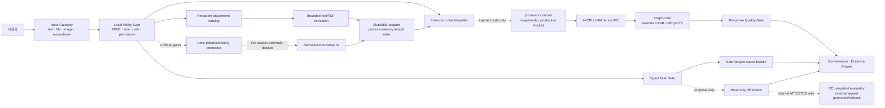

# CogniBoard v0.4.1 기능 확장 로드맵

> 이 문서는 v0.4.1 통합 **작업 트리**의 현재 구조와 남은 검증을 정리한다.
> 새 EXE·배포 번들·정식 릴리스가 만들어졌다는 뜻이 아니다.

## 1. 판정 원칙

CogniBoard는 모델이 말한 기능이 아니라 현재 프로세스가 검증한 runtime capability를
표시한다. 다음 상태를 서로 바꾸어 부르지 않는다.

- **구현·회귀 통과:** 로컬 코드 경로와 자동화 테스트가 존재한다.
- **부분 구현:** 경로는 있으나 실제 모델·장치·브라우저·외부 서비스 검증이 남았다.
- **미구현:** 제품 실행 경로가 없다.
- **외부 차단:** 코드가 있어도 계정·토큰·약관·목표 장치 같은 외부 조건이 없다.
- **계획:** 설계 목표이며 실행 사실이 아니다.

로컬 추론과 온라인 연구는 동시에 같은 상태로 표시하지 않는다. 일반 모드는
air-gapped이며 Lens 검색은 명시적 네 가지 gate를 모두 통과한 요청만 허용한다.

## 2. v0.4.1 통합 범위

| 영역 | 현재 구현 | 정직한 경계 |
|---|---|---|
| 대화 | Gemma 4 instruction chat template, no-cache decode, 반복·역할 누출·미완결 품질 gate | 실제 답변 품질은 prompt별 회귀가 필요 |
| 모델 IPC | text와 image/audio 고정 4-tensor protocol·주입 processor tests | production `Gemma4Processor` path-loader는 바이트 결합 미증명으로 차단; video IPC·forward 없음 |
| 이미지 | 첨부 선택·processor/worker 계약·fake-worker E2E | production path-loader 차단, 실제 Gemma image answer·품질·VRAM 미검증 |
| 음성 | 브라우저 capture, 권한·중단, 16 kHz WAV, STT 계약, Windows TTS·재생 | production multimodal loader 차단; 단일 historical 실측 외 WER·브라우저 E2E·packet audit·VRAM 미완료 |
| 첨부·RAG | content-addressed blob, 영속 catalog, PDF 추출, page/offset/digest provenance, 악성 corpus, 삭제·재색인·restart rebuild | semantic verifier/test 경계는 있으나 production loader·artifact·품질·answer authority·exact-scope attestation 미완료 |
| AkasicDB | pinned Graph/Relational/Vector adapter, deterministic lexical retrieval | store는 process-memory; catalog에서 재구성, semantic 검색 아님 |
| Lens.org | official API client, normalized record, provenance, AkasicDB bridge | 승인 토큰·약관·실응답이 없어 live 기능은 외부 차단 |
| 일반 웹 | Brave 공식 JSON endpoint 전용 opt-in connector·provenance·취소 경계 | 승인 subscription/token·live response·품질·egress 감사 미완료 |
| 코드 산출물 | bounded `/project` bundle을 output-only로 원자 저장·해시 검증 | 생성물 실행·자동 테스트·source 변경 없음 |
| Self-Harness | 기본 UI의 증거 ledger·read-only diff, 내부 Linux ATTESTED 평가·외부 서명 승격·signed committed rollback, detached external runner statement import와 운영자 전용 append-only E2E chain/validator | 자동 승격·UI apply endpoint는 금지 유지; 독립 평가자가 발행한 실제 production runner statement와 current raw E2E 실행 증거 없음 |

## 3. 메뉴별 현재 상태와 다음 대상

| 메뉴/영역 | 현재 제공 범위 | 남은 문제 | 다음 승격 조건 | 우선순위 |
|---|---|---|---|---|
| AI 워크스페이스 | 확대 대화, sticky composer, 첨부/RAG, 이미지 선택, 마이크, TTS, Lens gate, 모델 상태 | 실제 브라우저 해상도·권한·장시간 사용 QA 부족 | 실제 Windows 브라우저 E2E와 접근성 QA | P0 |
| 미션 컨트롤 | 제품 가치와 검증 snapshot | 계획·구성·실측을 사용자가 혼동할 수 있음 | 모든 카드에 evidence class와 frozen-build digest 연결 | P0 |
| 라이브 검증 | 모델 무결성, CTS/DEQ, 메모리 경계 | 새 image/audio/RAG/Lens 경로와 동일 frozen build 실측 부족 | 모달리티별 실행 로그와 target-device evidence | P0 |
| 시스템 설계 | Cogni-Core/Cogni-Flow, 주·야간, 입력·검색 흐름 | 실행 권한과 데이터 흐름의 차이를 계속 명시해야 함 | v0.4.1 아키텍처와 UI capability 상태 동기화 | P1 |
| 사업 임팩트 | 목표 산업·사업 논리·계획 | 현재 구현과 장기 계획의 경계가 약함 | PoC/검증/상용 상태 필터 및 근거 링크 | P1 |
| 증빙·로드맵 | Fact-book, page/offset/digest RAG drawer, Lens provenance, proposal review | exact-scope drawer attestation·live Lens·release digest 부족 | 독립 evidence, 외부 응답, bundle SHA 통합 | P0 |
| Evidence Rail | 모델·네트워크·검증 상태 | 세부 모달리티의 실제 검증 범위가 짧게 축약됨 | text/image/audio/RAG/Lens/tools 별 상태와 마지막 검증 시각 | P0 |

## 4. 구현 작업 목록과 현재 판정

| ID | 작업 | 현재 상태 | 현재 확인된 범위 | 완료 전 남은 조건 |
|---|---|---|---|---|
| W1 | 대화 UX 재구성 | 구현·회귀 통과 | 1080p 우선 대화 영역, sticky 입력창, 첨부·음성 composer | 실제 브라우저·배율·접근성 시각 QA |
| W2 | 첨부 수신·관리 | 구현·회귀 통과 | MIME/signature/크기/개수/경로 gate, content-addressed blob, 영속 catalog, 목록·preview·삭제·재색인 | unlink 실패 orphan 처리와 실제 bundle E2E |
| W3 | Gemma 4 멀티모달 adapter | 부분 구현 | instruction template, 4-tensor worker IPC, image UI/API, 주입 processor image/audio/video 전처리 tests; production path-loader fail-closed | byte-bound processor loader·실제 image/audio/video answer·video IPC·품질·latency·VRAM |
| W4 | 로컬 음성 입출력 | 부분 구현 | 명시 클릭 capture, 30초 cap, stop/cancel, 16 kHz WAV, 동일 모델 STT, Windows TTS·재생; 한국어 단일 실측 통과 | WER corpus, 무음/소음/권한 revoke 실제 E2E, packet audit, VRAM |
| W5 | 모델 선택기 | 부분 구현 | bounded registry와 disabled-by-default drain/unload/memory-proof/load/health/CAS/rollback 제어 primitive; 현재 worker만 selectable | concrete resident supervisor·factory·독립 zero-memory probe를 제품에 연결하고 GPU/modalities 전환 E2E |
| W6 | AkasicDB RAG adapter | 구현·회귀 통과 | 고정 revision·3개 store adapter, deterministic lexical retrieval, restart rebuild; 별도 manifest verifier/test encoder 경계 | byte-bound semantic loader, 독립 LICENSE, artifact·품질·poisoning 평가와 answer-bearing 결합 |
| W7 | RAG 수집 pipeline | 구현·검증 대기 | text/code/PDF 추출·청킹·dedup, catalog persistence, delete/reindex, page/offset/digest citation, parser timeout/reap와 악성 corpus | 독립 exact-scope attestation |
| W8 | 코드 작업 환경 | 부분 구현 | bounded read/search/fixed pytest, safe output bundle, read-only UI와 내부 ATTESTED 평가·외부 서명 승격·signed committed rollback·운영자 E2E chain validator | hostile-code production isolation 독립 attestation·독립 runner statement·같은 boundary의 current raw production E2E evidence |
| W9 | 일반 웹 검색 | 구현·검증 대기 | Brave 공식 JSON GET만 허용하는 다중 opt-in gate, bounded schema·URL·time/digest provenance, 취소/revoke | 승인 subscription/token의 live 응답·UI/browser E2E·packet/egress 감사 |
| W10 | Lens 특허 검색 | 외부 차단 | 공식 `/patent/search` connector·schema·retry·provenance와 mocked tests | 승인 token·terms·plan에서 live response 검증 |
| W11 | Lens 논문 검색 | 외부 차단 | 공식 `/scholarly/search` connector·schema·retry·provenance와 mocked tests | 승인 token·terms·plan에서 live response 검증 |
| W12 | Lens→AkasicDB 색인 | 부분 구현 | normalized record→RAG document→AkasicDB bridge와 fake-sink tests | live response, durable external-record catalog, citation E2E |
| W13 | 답변 인용·근거 drawer | 구현·검증 대기 | 문장별 citation·local file/chunk/score/page/offset/digest, 독립 drawer, 정규화 추출물 표시와 Lens canonical URL/provenance | DOI live attribution과 독립 exact-scope attestation |
| W14 | 회귀·보안 검증 | 부분 구현 | 전체 software regression, path/MIME/size/schema/prompt-injection/secret-redaction checks | 실제 Gemma adversarial corpus, packet audit, target RTX 4090, packaged EXE |

## 5. Instruction preprocessing와 4-tensor IPC

텍스트는 검증된 Gemma 4 instruction chat contract로 렌더링한다. production tokenizer가
해당 contract를 제공하지 않으면 ASCII transcript로 대체하지 않고 실패한다. 이미지와
음성은 주입 processor 테스트에서만 호환 `apply_chat_template`에 typed content와
`add_generation_prompt=True`를 전달한다. 현재 production `Gemma4Processor`
path-loader는 검증 바이트와 parser 입력을 결합할 수 없어 생성 단계에서 fail-closed이며,
image/audio answer-bearing 요청은 허용하지 않는다.

worker request는 모달리티와 관계없이 다음 네 CPU `torch.int64` tensor뿐이다.

1. header
2. `input_ids`
3. `attention_mask`
4. control + descriptors + packed payload

응답도 정확히 네 CPU `int64` tensor다. `pixel_values`와 `input_features`가 원래
부동소수 tensor라는 사실은 descriptor에 보존되며, IPC control tensor에서 bit 단위로
복원된다. 따라서 “내부 tensor 통신”은 충족하지만, 실제 model-forward·품질·VRAM까지
통과했다는 뜻은 아니다.

## 6. 첨부·PDF·AkasicDB 영속성

첨부 원본은 project output root 아래 content-addressed blob으로 저장된다.
`attachment-catalog.v1.json`은 atomic replace로 기록하며 원래 파일명, digest,
media type, 생성 시각, 색인 상태를 보존한다. 재시작 시 blob digest와 catalog를 검증한
뒤 process-memory AkasicDB index를 재구축한다.

PDF는 로컬 `pypdf`로 다음 경계를 적용한다.

- 파일 최대 8 MiB
- 최대 128 pages
- 추출 최대 256,000 characters
- encrypted/malformed/textless PDF fail-closed

현재 chunk는 물리 PDF page 번호, 정규화된 page-relative 문자 범위, 발췌 SHA-256과
`normalized_extracted_excerpt_v1` 표현 의미를 함께 보존한다. 별도 worker의 wall-clock
timeout·kill/reap과 encrypted/truncated/textless/page-limit/control-character corpus를 CPU
회귀로 검증한다. 이 경로는 구현됐지만 승인된 exact-scope release attestation이 없어
`IMPLEMENTED_UNVERIFIED`로 유지한다.

AkasicDB adapter는 audited fixed revision의 GraphStore, RelationalStore,
VectorStore만 사용한다. answer-bearing embedding은
`stable_sha256_lexical_sketch_v1`이며 lexical token overlap을 함께 요구한다. 별도
manifest-bound verifier와 test-only CPU encoder 경계는 존재하지만 production path-loader는
검증 바이트 결합 미증명으로 비활성이다. 실제 artifact·독립 품질·라이선스 검토·poisoning
평가가 없고 `answer_bearing=false`이므로 현재 검색 의미는 바뀌지 않는다.

## 7. Lens.org 공식 4-gate

공식 Lens connector는 HTML scraping이나 로그인 browser automation을 사용하지 않는다.
다음 네 조건이 모두 참이어야만 `api.lens.org`로 HTTPS POST를 보낸다.

1. `COGNI_OS_ONLINE_MODE=1`
2. `COGNI_OS_WEB_ALLOWLIST`에 정확히 `api.lens.org` 포함
3. `COGNI_OS_LENS_API_TOKEN` 설정
4. `COGNI_OS_LENS_TERMS_ACCEPTED=1`

endpoint는 `/patent/search`와 `/scholarly/search`로 고정되고 redirect를 따르지 않는다.
query/result/response/timeout/retry/concurrency를 제한하며 token을 log나 RAG text에 남기지
않는다. 결과에는 Lens ID, canonical URL, retrieval 시각, query SHA-256, source-record
SHA-256을 붙이고 필요하면 AkasicDB로 전달한다.

현재 네 gate를 만족하는 승인 credential과 live evidence가 없다. 따라서 connector code와
mocked regression은 구현됐지만 W10/W11은 `외부 차단`, W12는 `부분 구현`이다. 일반 웹검색은
Lens connector와 분리된 Brave 공식 JSON API 경계이며 기본 OFF·operator/provider/host/token/
terms/request opt-in을 모두 요구한다. 이 경로도 실 subscription 응답과 egress 감사 전에는
완료가 아니다.

공식 참고 자료:

- Lens Patent and Scholar API: <https://support.lens.org/knowledge-base/lens-patent-and-scholar-api/>
- Lens API documentation: <https://docs.api.lens.org/>
- Lens API terms: <https://about.lens.org/lens-api-terms-of-use/>
- Lens developer resources: <https://about.lens.org/for-developers/>

## 8. 음성 capture·STT·TTS 경계

브라우저는 사용자가 microphone button을 누른 뒤에만 권한을 요청한다. 녹음은 최대 30초,
mono PCM 16-bit 16 kHz WAV로 변환하며 stop/cancel과 permission-denied/no-device 문구를
제공한다. authenticated loopback API가 음성을 받는다.

STT adapter 계약은 이미 resident인 manifest-bound Gemma service를 재사용하고 두 번째
model을 로드하지 않도록 설계되어 있다. 다만 현재 production multimodal loader가
fail-closed이므로 resident Gemma STT는 활성 capability가 아니다. Windows TTS는 installed
`System.Speech` voice를 fixed command로 호출하며 UI에서 최신 완료 답변을 play/stop한다.
runtime probe가 실패하면 해당 기능을 비활성화한다.

v0.4.0 개발 장치의 historical 한국어 Windows TTS→동일 manifest-bound Gemma STT
단일 검증은 exact transcript, normalized similarity 1.0, 5.0187초/16 kHz,
`external_calls=0`으로 통과했다. 그러나 이는
다화자·소음·억양 WER corpus, 실제 browser microphone, packet capture, target GPU VRAM을
대체하지 않는다. 따라서 전체 음성 기능 상태는 아직 부분 구현이다.

## 9. 안전한 `/project` bundle과 proposal review

safe project bundle은 정확한 typed JSON만 받는다. project당 1–12개의 allowlisted UTF-8
파일과 총 256 KiB만 허용하며 path depth/name/suffix를 검증한다. Python은 AST parse,
JSON은 duplicate key와 non-finite number까지 검사한다. private staging directory에서
`outputs/agent-workspace`로 no-overwrite atomic commit한 뒤 manifest와 SHA-256을 다시 읽어
검증한다.

이 bundle은 **산출물 저장 기능**이다. 생성 코드를 실행하거나 테스트하지 않으며 source를
수정하지 않고 network를 사용하지 않는다.

Self-Harness proposal review는 base/replacement digest와 현재 source를 대조하고 bounded
unified diff만 반환한다. stale base의 diff는 숨긴다. 현재 사용자 endpoint에는 approval,
execution, source mutation, apply, promotion, rollback 권한이 없다.

별도의 Linux 내부 ATTESTED 경로는 bounded snapshot 평가 뒤 immutable evidence를 남기고,
fresh drain/checkpoint와 exact external Ed25519 authority 아래에서만 one-shot promotion 또는
signed committed rollback을 수행한다. detached statement loader는 외부 서명·TTL·nonce와 exact
OCI evidence/engine/image/command/runner source를 검증하고, 운영자 E2E ledger는 K≥3 후보부터 두
서명과 byte-identical rollback까지를 append-only chain으로 묶는다. 그러나 named engine/image의
CPU integration smoke 자체는 production isolation attestation이 아니며, 독립 평가자가 실제
production boundary에 발행한 statement와 current raw E2E가 없으므로 이를 “자가 코드 수정 완료”라고
표시해서는 안 된다.

## 10. 현재 데이터 흐름

## 11. 남은 승격 순서

1. 모든 변경을 한 commit으로 동결하고 전체 회귀를 다시 실행한다.
2. 실제 browser microphone/permission/TTS playback과 image attachment E2E를 수행한다.
3. image/audio 실제 Gemma model-forward, answer quality, latency, peak VRAM을 측정한다.
4. PDF page provenance, parser timeout/adversarial corpus, 정규화 추출물 표시 계약을
   exact-scope release attestation에 결합한다.
5. 현재 fail-closed local semantic encoder 경계에 검토된 artifact를 공급하고
   license·quality·poisoning·RAM/latency evidence를 통과한 뒤에만 RAG authority를 연결한다.
6. 승인된 Lens account/token/terms에서 patent/scholarly live response와 attribution을 검증한다.
7. detached runner statement import와 운영자 E2E chain을 hostile-code production isolation의
   독립 평가자 서명 및 한 환경의 current raw 전체 E2E와 결합한다. 그 전까지 사용자 UI와
   Runtime Fact-book은 read-only `proposal_only` 상태를 유지한다.
8. target RTX 4090에서 재실측하고 새 EXE/bundle을 동일 commit/SHA로 만들어 smoke한다.

`구현·회귀 통과`는 개발 source의 software contract를 뜻한다. 배포 EXE, 목표 RTX 4090,
공인 시험, 일반 semantic RAG, live Lens 권한, 자동 source patch promotion까지 인증했다는
뜻이 아니다.
