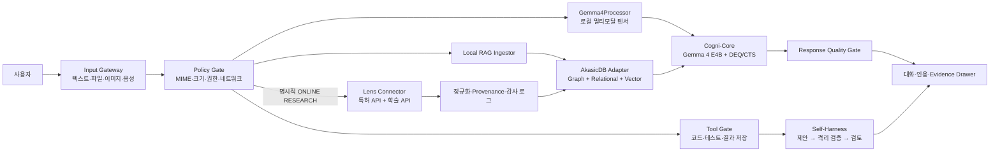

# CogniBoard 워크스페이스 기능 확장 로드맵

## 1. 원칙

CogniBoard의 기능 표시는 모델이 할 수 있다고 말하는 내용이 아니라, 현재 프로세스가
검증한 런타임 capability를 기준으로 한다. 로컬 전용 추론과 외부 검색은 같은 상태로
동시에 표시하지 않는다. 온라인 검색은 사용자가 명시적으로 전환한 세션에서만 허용하고,
검색어·도메인·시각·수집 문서 식별자를 감사 로그에 남긴다.

## 2. 메뉴 및 기능 갭

| 메뉴/영역 | 현재 제공 범위 | 확인된 문제 | 추가 대상 | 우선순위 |
|---|---|---|---|---|
| AI 워크스페이스 | 로컬 텍스트 대화, 제한된 프로젝트 작업, 실행 상태 | 대화 영역이 작고 입력 도구가 부족함 | 대화 영역 확대, 고정 입력창, 첨부·RAG·온라인 검색·음성·모델 선택기 | P0 |
| 미션 컨트롤 | 제품 가치와 검증 스냅샷 | 계획 수치와 실측 수치가 혼동될 수 있음 | 실측/구성 검증/계획 배지의 일관된 표기 | P0 |
| 라이브 검증 | 모델 무결성, CTS Depth 100, VRAM 경계 검증 | 대화·RAG·멀티모달 회귀와 분리됨 | 텍스트/RAG/이미지/음성별 검증 시나리오와 증거 링크 | P0 |
| 시스템 설계 | Cogni-Core/Cogni-Flow, 주·야간 경계 | 입력·검색·인용 데이터 흐름이 없음 | Input Gateway, AkasicDB Adapter, Lens Connector, Evidence Store 표시 | P1 |
| 사업 임팩트 | 목표 산업, 사업 논리, 계획 | 현재 기능과 향후 기능의 구분이 약함 | PoC/검증/상용 상태 필터와 근거 출처 | P1 |
| 증빙·로드맵 | Fact-book, 시험·계획 분류 | 새 커넥터의 데이터 출처와 약관 근거가 없음 | RAG 문서 provenance, Lens ID/DOI/특허번호, 검색 감사 로그 | P0 |
| Evidence Rail | 모델·네트워크·검증 상태 | 기능별 상태를 한눈에 보기 어려움 | Text, Vision, Audio, RAG, Lens, Tools capability 칩 | P0 |

## 3. 구현 작업 목록

| ID | 작업 | 완료 기준 | 기본 정책 |
|---|---|---|---|
| W1 | 대화 UX 재구성 | 1080p에서 입력창과 최근 대화가 첫 화면에 보이고 전역 가로 스크롤이 없음 | 로컬 |
| W2 | 첨부 수신 게이트 | 확장자·MIME·크기·개수·경로 검증, 메모리/격리 저장, 취소·삭제 가능 | 로컬 |
| W3 | Gemma 4 멀티모달 어댑터 | `Gemma4Processor`가 이미지/16kHz 오디오를 텐서화하고 검증된 모델 worker로 전달 | 로컬, 미검증 시 차단 |
| W4 | 로컬 음성 입력 | 사용자 동의 후 녹음, 로컬 ASR, 원본 보존 여부 선택, 네트워크 전송 0 검증 | 로컬 |
| W5 | 모델 선택기 | 검증된 로컬 manifest만 열거하고 VRAM·모달리티·상태 표시 | 원격 모델 금지 |
| W6 | AkasicDB RAG 어댑터 | 고정 커밋의 Graph/Relational/Vector 경로를 bounded adapter로 호출하고 출처를 함께 반환 | 로컬 |
| W7 | RAG 수집 파이프라인 | PDF/텍스트/코드 청킹, 안정적 문서 ID, 중복 제거, 삭제/재색인, 인용 가능 | 로컬 |
| W8 | 코드 작업 환경 | 읽기/검색/패치 제안/격리 테스트/증거 저장의 명시적 권한 단계 | 기본 제안 전용 |
| W9 | 일반 웹 검색 | 사용자 opt-in, 도메인 allowlist, 검색 결과 스냅샷·URL·시각 표시 | 기본 차단 |
| W10 | Lens 특허 검색 | 공식 `patent/search`를 통해 Lens ID, 제목, 관할, 상태, 출원인, 패밀리 정보 수집 | 토큰·온라인 모드 필요 |
| W11 | Lens 논문 검색 | 공식 `scholarly/search`를 통해 Lens ID, DOI, 제목, 저자, 연도, 인용 관계 수집 | 토큰·온라인 모드 필요 |
| W12 | Lens→AkasicDB 색인 | 검색 결과를 정규화하고 특허↔논문 인용 그래프와 메타데이터/벡터를 함께 색인 | provenance 필수 |
| W13 | 답변 인용과 근거 서랍 | 문장별 출처, Lens/DOI/특허 링크, 검색 시각, 원문/요약 구분 | 근거 없으면 표시 |
| W14 | 회귀 및 보안 검증 | 파일 폭탄, 경로 탈출, MIME 위장, prompt injection, 토큰 유출, 네트워크 오작동 테스트 | fail-closed |

## 4. Lens.org 통합 판단

Lens는 특허와 학술 문헌을 각각 검색하는 공식 REST API를 제공한다. 2026년 4월 기준
API 문서는 특허 `https://api.lens.org/patent/search`, 학술 문헌
`https://api.lens.org/scholarly/search` 엔드포인트를 안내한다. 접근에는 Lens 계정에서
승인받은 API 권한과 Bearer 토큰이 필요하다. 시험 플랜은 제한적·비상업적 사용을 위한
단기 접근이고, 지속적 자동화나 상용 통합은 Member/Custom 플랜 검토가 필요하다.

따라서 제품 구현은 다음 순서를 따른다.

1. 사용자가 `ONLINE RESEARCH` 모드로 명시 전환한다.
2. Secret Store에서 Lens 토큰을 읽되, 로그·RAG 문서·프롬프트에는 토큰을 기록하지 않는다.
3. 특허/논문 검색 요청을 별도 커넥터 프로세스로 전송한다.
4. 응답을 bounded schema로 검증하고 원문 식별자와 attribution을 보존한다.
5. 정규화된 레코드를 AkasicDB의 관계형·그래프·벡터 경로에 색인한다.
6. 답변에는 Lens ID/DOI/특허번호와 검색 시각을 근거로 노출한다.
7. 온라인 세션 종료 시 즉시 네트워크 차단 상태로 복귀한다.

로그인된 웹 화면을 자동 조작하거나 HTML을 스크래핑하는 방식은 화면 변경, 세션 유출,
약관 및 재현성 문제 때문에 제품 데이터 경로로 사용하지 않는다. API 토큰이 없을 때는
Lens의 공식 특허/학술 검색 페이지를 사용자가 직접 여는 보조 기능만 제공하고, 자동 RAG
수집 상태는 `인증 필요`로 표시한다.

공식 참고 자료:

- Lens Patent and Scholar API: <https://support.lens.org/knowledge-base/lens-patent-and-scholar-api/>
- Lens API documentation: <https://docs.api.lens.org/>
- Lens API terms: <https://about.lens.org/lens-api-terms-of-use/>
- Lens developer resources: <https://about.lens.org/for-developers/>

## 5. AkasicDB 통합 경계

사용자가 지정한 `heosanghun/AkasicDB`는 커밋
`a6c8e8ebd487e7cb86079f9804a66aaf0914d1dc`을 기준으로 검토한다. 현재 저장소의
핵심은 GraphStore, RelationalStore, VectorStore와
Traversal-Join-Similarity 연산자인 프로토타입이다. 데모 서버에는 원격 모델 다운로드,
무한 재시도, 광범위 CORS, 합성 데이터와 하드코딩 응답, 프로세스마다 결과가 달라질 수
있는 Python `hash()` 임베딩이 포함되어 있으므로 그대로 실행하거나 포함하지 않는다.

CogniBoard는 다음 경계를 둔 adapter만 사용한다.

- 외부 clone 경로와 고정 commit을 provenance에 기록한다.
- 입력 길이, 후보 수, 그래프 깊이, top-k와 반환 바이트를 제한한다.
- 안정적인 SHA-256 기반 테스트 임베딩 또는 검증된 로컬 임베딩 모델을 사용한다.
- 검색 결과마다 문서 ID, 원본 경로/URL, 수집 시각, 청크 범위를 보존한다.
- AkasicDB 저장소에 독립 LICENSE 파일이 확인되기 전에는 소스를 vendor하거나 배포물에
  복사하지 않는다.

## 6. 멀티모달 상태

로컬 `gemma4-e4b-it` 체크포인트에는 `Gemma4Processor`, 이미지 processor,
16kHz 오디오 feature extractor, vision/audio 설정과 image/audio/video 토큰이 실제로
존재한다. 따라서 체크포인트 자체는 멀티모달이다. 그러나 현재 CogniBoard model worker
프로토콜은 `input_ids`와 `attention_mask`만 전달하므로, 지금 화면에서 이미지·음성을
받는 것만으로 멀티모달 추론이 활성화되는 것은 아니다. W2와 W3의 텐서 계약, VRAM
경계, 회귀 검증을 통과한 뒤 capability를 `ACTIVE`로 승격한다.

## 7. 목표 데이터 흐름

## 8. 현재 구현 상태

| ID | 상태 | 현재 확인된 범위 | 다음 승격 조건 |
|---|---|---|---|
| W1 | 구현·회귀 통과 | 1080p 우선 대화 영역, sticky 입력창, composer 도구 | 실제 브라우저 해상도별 시각 QA |
| W2 | 부분 구현 | MIME·서명·크기·개수·경로 검증, content-addressed 저장, 재시작 누적 quota | 첨부 삭제·정리·재등록 UX |
| W3 | 미구현 | 체크포인트의 image/audio/video 구성을 Fact-book에만 노출 | `Gemma4Processor` 텐서 IPC와 VRAM/품질 검증 |
| W4 | 미구현 | 마이크·전사 실행기가 없음을 UI에서 차단 표시 | 로컬 녹음·ASR·동의·삭제 정책 검증 |
| W5 | 부분 구현 | 현재 Fact-book으로 검증된 단일 모델만 선택 가능 | 복수 manifest registry와 GPU 전환 검증 |
| W6 | 구현·회귀 통과 | AkasicDB 고정 commit·3개 핵심 파일 hash adapter, 로컬 lexical retrieval | 독립 LICENSE 확인과 검증된 semantic embedder |
| W7 | 부분 구현 | UTF-8 text/markdown/csv/json 청킹·중복 제거·근거 반환 | PDF 추출, 삭제·재색인, 영속 provenance catalog |
| W8 | 기존 제한 구현 | 프로젝트 내부 read/search, output-only write, 고정 test allowlist | OS 격리 증거가 있는 확장 tool runner |
| W9 | 정책만 구현 | online opt-in·allowlist·URL 검증 상태, 실제 executor는 비활성 | 검색 provider, 응답 schema, 감사·인용 검증 |
| W10 | 작업 목록 | Lens 특허 API endpoint·토큰·allowlist 상태만 표시 | 승인된 토큰과 공식 API connector 구현 |
| W11 | 작업 목록 | Lens 학술 API endpoint·토큰·allowlist 상태만 표시 | 승인된 토큰과 공식 API connector 구현 |
| W12 | 미구현 | 목표 데이터 흐름만 정의 | Lens 레코드 schema·provenance·AkasicDB graph 색인 |
| W13 | 부분 구현 | 로컬 RAG `[근거 N]` 검증, 파일명·점수 근거 서랍 | 문장별 인용, 원문 위치, Lens/DOI/특허 링크 |
| W14 | 구현 범위 회귀 통과 | 경로·MIME·크기·JSON 깊이·prompt injection 경계와 API/UI 테스트 | 실제 Gemma adversarial corpus, packet audit, 복수 장치 실측 |

`구현·회귀 통과`는 현재 개발 source의 소프트웨어 테스트 결과를 뜻한다. 배포 EXE,
목표 RTX 4090, 공인 시험 또는 Lens 상용 권한까지 인증했다는 뜻은 아니다.
