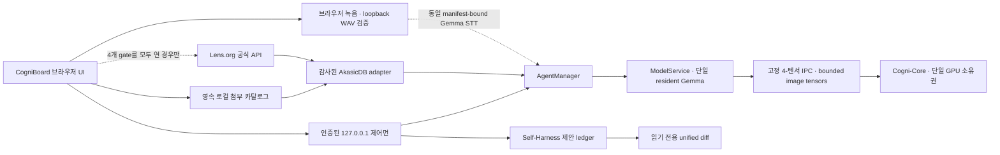

# CogniBoard 사용자 매뉴얼 및 운영 플레이북

- 제품: Cogni-OS 2.0 Genesis
- 화면: CogniBoard — Sovereign AI Mission Control
- 문서 기준 버전: 0.4.1
- 기본 운영 모드: 로컬 전용·외부 호출 차단
- 문서 원칙: 구현, 현재 실행의 실측, 외부 조건을 서로 섞어 말하지 않는다.

## 1. 이 문서가 답하는 것

CogniBoard는 로컬 Gemma 4 E4B-it 대화, Cogni-Core, 라이브 검증, 제한된 로컬
도구, 로컬 지식 검색, Self-Harness 제안 검토를 한 화면에서 운영하는 제어면이다.
이 문서는 사용자가 다음 세 질문에 같은 기준으로 답하도록 돕는다.

1. 이 화면에서 지금 무엇을 할 수 있는가?
2. 어떤 기능이 코드와 회귀 테스트로 구현되었지만 현재 장치에서 다시 검증되어야
   하는가?
3. 어떤 기능은 별도 로컬 아티팩트, 계정, 이용약관 또는 목표 장치가 있어야
   활성화되는가?

### 1.1 상태 표시 기준

| 표시 | 의미 | 말해도 되는 범위 |
|---|---|---|
| `구현·테스트됨` | 소스와 자동 회귀 검사가 존재 | 현재 PC의 성능·품질까지 자동 증명한 것은 아님 |
| `라이브 검증 필요` | 제품 경로는 있으나 이번 프로세스의 실측이 필요 | `VERIFIED` 전에는 과거 수치나 목표 수치를 실측처럼 말하지 않음 |
| `외부 조건 필요` | 로컬 모델·토큰·약관·OS 권한·장치가 별도로 필요 | 조건이 없으면 버튼 비활성화 또는 안정된 오류 코드로 종료 |
| `연구/제안 전용` | 결과를 검토할 수 있으나 자동 적용 권한이 없음 | 제품 소스 자동 수정·무인 승격이라고 말하지 않음 |
| `목표/사업계획` | 향후 시험·시장·매출 목표 | PASS, 인증, 계약 완료로 표현하지 않음 |

`READY`는 제어 경로가 대기 중이라는 뜻이지 모델이 이미 VRAM에 적재되었다는
뜻이 아니다. `VERIFIED`는 같은 프로세스에서 라이브 검증이 통과한 뒤에만 의미가
있다. `구성됨·실행 미검증`은 아티팩트와 호출 경로가 있다는 뜻일 뿐이다. 이미지나
STT 버튼은 현재 프로세스의 processor probe와 answer-bearing model inference 증거가
모두 확인되기 전까지 비활성화된다.

## 2. 시작 전 준비와 1분 빠른 시작

### 2.1 기본 준비

- Windows 11 64-bit와 지원되는 로컬 Python/CUDA/PyTorch 환경
- 로컬 instruction-tuned 모델 기본 경로
  `C:\Project\cognios\gemma4-e4b-it`
- 모델과 함께 배포된 신뢰 manifest
- EXE와 같은 릴리스에서 나온 source, wheel, 체크섬, 매뉴얼
- 대화·검증 중 다른 프로세스가 GPU 메모리를 과도하게 점유하지 않는 환경

배포 번들에 포함된 실제 파일명과 `SHA256SUMS.txt`를 먼저 확인한다. v0.4.1
소스에서 새 번들을 만들기 전에는 이전 버전 EXE를 v0.4.1 실행 파일이라고 부르지
않는다.

```powershell
Get-Content .\SHA256SUMS.txt
Get-ChildItem -File | ForEach-Object {
  $hash = (Get-FileHash -LiteralPath $_.FullName -Algorithm SHA256).Hash.ToLower()
  "${hash}  $($_.Name)"
}
```

### 2.2 1분 빠른 시작

1. 검증된 배포 폴더의 `CogniBoard-v0.4.1.exe`를 더블클릭한다.
2. 브라우저에서 `LOCAL ONLY`, 리듬 `INFERENCE`, 오른쪽 Evidence Rail을
   확인한다.
3. `AI 워크스페이스`에서 일반 질문을 한 번 보낸다.
4. 모델·파라미터·권한 질문을 보내 `Runtime Fact-book` 답변과 일반 모델 답변이
   구분되는지 확인한다.
5. `라이브 검증`에서 `검증 시작`을 누른다.
6. 완료 후에만 장치, Peak VRAM, CTS depth, DEQ residual과 `VERIFIED`를
   현재 실행 증거로 사용한다.

현재 v0.4.1 소스 checkout에는 `release\CogniBoard-v0.4.1.exe`가 포함되어 있지
않다. 위 파일명은 새 동결 commit에서 빌드하고 checksum·cold-start smoke를 통과한
배포 폴더에만 적용한다. 빌더만 있거나 이전 버전 EXE만 있는 상태에서는 이 경로를
현재 실행 파일로 안내하지 않는다.

## 3. 전체 구조



자연어는 브라우저와 CPU 제어면에서만 다룬다. 모델 프로세스 경계는 고정 텐서
스키마, 크기, dtype, deadline, 세션·아티팩트 digest를 검사한다. 이미지 경로도
별도 모델을 하나 더 띄우지 않고 같은 resident Gemma 경로를 사용한다.

### 3.1 상단 상태 바

- `LOCAL ONLY`: 기본 air-gap 정책이다. Lens 온라인 opt-in을 활성화하면
  `ONLINE OPT-IN`으로 바뀌어야 한다.
- `외부 호출 0`: 현재 앱이 기록한 외부 호출 수다. 독립 패킷 감사를 대신하지
  않는다.
- `리듬 INFERENCE`: 추론 상태다. 진화 작업과 동시에 GPU를 소유하지 않는다.
- `검증 READY/VERIFIED`: 라이브 검증 대기/성공을 구분한다.
- `3분 IR 모드`: 여섯 화면을 발표 순서로 안내한다.
- 전체화면: 발표용 화면을 전환한다.
- 전원: 활성 작업을 안전하게 정리한 뒤 로컬 서버를 종료한다.

### 3.2 Evidence Rail

- `NOT VERIFIED`: 현재 프로세스 검증 전 또는 실패 상태
- `LIVE RUNNING`: 현재 검증 중
- `VERIFIED`: 현재 프로세스에서 요구된 검증이 모두 통과
- `Model`, `Manifest`, `Runtime`: 실행 대상과 빌드 식별자
- `App external calls`: 앱의 외부 실행 정책
- `KV cache DISABLED`: 깊이별 KV-cache 누적을 사용하지 않는 구성
- `측정 환경`: 검증 전에는 `실행 전 미측정`

O(1) 표시는 고정 용량 CTS 작업 텐서의 깊이 증가 특성을 가리킨다. 모델 가중치,
로그, 첨부 저장소, 전체 애플리케이션 메모리까지 모두 O(1)이라는 뜻이 아니다.

## 4. 왼쪽 여섯 메뉴

### 4.1 AI 워크스페이스

대화, 로컬 작업, 첨부, RAG, 이미지, Lens, 음성, Self-Harness 상태를 다루는
주 작업 화면이다.

- `로컬 AI 대화`: 사용자·Agent·Fact-book·도구·시스템 메시지를 구분한다.
- `새 대화`: 현재 대화 세션을 초기화한다.
- `중단`: 현재 생성 또는 작업을 협력적으로 취소한다.
- `대화`: 일반 모델 생성, Fact-book, 제한된 대화 fast path를 사용한다.
- `로컬 작업`: allowlist 명령과 안전한 산출물 저장만 허용한다.
- `인지 파이프라인`: Gemma, BIO-HAMA, System 3/4, DEQ/CTS,
  System 1.5/2.5의 현재 상태를 표시한다.
- `작업 권한`: 읽기·쓰기·테스트·소스 수정 경계를 보여준다.
- `자가 거울치료`: 영속 증거 수, 검토 대기 제안, 자동 승격 차단 상태를
  보여준다.

### 4.1.1 응답 배지 해석

| 배지/역할 | 의미 | 모델 생성 여부 |
|---|---|---:|
| `Cogni Agent` | 로컬 Gemma/Cogni-Core 응답 | 있음 |
| `cogni_core_image` | 검증된 이미지 한 장을 함께 사용한 응답 | 있음 |
| `cogni_core_rag` | 로컬 검색 근거를 함께 사용한 응답 | 있음 |
| `Runtime Fact-book` | 모델·빌드·권한의 검증된 스냅샷 | 없음 |
| `대화 FAST PATH` | 매우 제한된 인사·협업 연결 응답 | 없음 |
| `품질 검증 실패` | 후보 게시를 거부하고 안전 문장으로 종료 | 후보 게시 없음 |
| `도구` | allowlist 로컬 작업 결과 | 없음 |
| `시스템` | 정책 거부·오류·연결 안내 | 없음 |

Fact-book이 답한다고 모델 워커가 정상이라는 뜻은 아니다. 일반 질문만 실패하면
시스템 메시지와 모델 초기화 상태를 확인한다.

### 4.1.2 로컬 모델 선택기의 현재 범위

입력창의 모델 선택기는 현재 resident worker 모델과, 명시적
`COGNI_OS_MODEL_REGISTRY_DIR` 아래에서 closed-world manifest·config digest 검증을
통과한 후보를 구분해 표시한다. 현재 worker 모델을 다시 선택하는 idempotent 요청만
허용한다. 발견된 다른 후보는 정보용으로 표시하지만 `selectable=false`이며 로드하지
않는다.

후보의 checkpoint modality 표시는 모델 metadata이지 image/audio 실행 권한이 아니다.
lease drain → 기존 worker unload → VRAM 확인 → 새 worker load → 실패 rollback을 잇는
안전한 전환 경로는 아직 구현되지 않았다. 따라서 다른 모델을 선택하거나 실제 전환할
수 있다고 안내하지 않는다.

### 4.2 미션 컨트롤

기술 데모와 사업 스토리를 한 화면에서 설명한다.

- `실제 통합 검증 시작`: 라이브 검증 화면으로 이동해 검증을 시작한다.
- `사업 가치 보기`: 사업 임팩트 화면으로 이동한다.
- `검증된 실행 스냅샷`: 로컬 Gemma, CTS, DEQ, C-FIRE 경계를 시각화한다.
- 지표 카드: Peak VRAM, CTS depth, DEQ residual, 회귀 증거를 표시한다.
- P-S-S-D: Problem, Solution, Scale-up, Defensibility 설명을 전환한다.

`실측 장치`는 현재 실행 장치이고 `목표 장치`는 RTX 4090 24GB 목표다. 개발
PC의 RTX 5090 Laptop 결과를 RTX 4090 인증으로 바꾸어 말하지 않는다.

### 4.3 라이브 검증

같은 명령으로 다음 파이프라인을 재현한다.

1. manifest·SHA-256 무결성 확인
2. 원격 다운로드 없이 로컬 Gemma 적재
3. Genesis 런타임과 GPU lease 구성
4. DEQ + 고정 301-node CTS Depth 100 실행
5. VRAM, finite, residual, fallback, 외부 호출 사후 검사

중앙 평형 탐색 그림은 진행 시각화이지 chain-of-thought 공개가 아니다. 취소·실패한
부분 결과는 `VERIFIED`로 승격되지 않는다. 16.7GiB, `L < 0.95`, residual 등의
판정은 실제 terminal metrics가 있을 때만 표시한다.

### 4.4 시스템 설계

- `Cogni-Flow`: CPU 제어면. Bio Rhythm, BIO-HAMA, AFlow,
  Self-Harness를 조정한다.
- `Bounded Tensor Boundary`: 자유형 객체 대신 고정 텐서 프로토콜을 사용한다.
- `Cogni-Core`: 단일 GPU 데이터면. Gemma 4, DEQ, CTS, Fast Weight,
  System 3/4, FP-EWC를 포함한다.
- `C-FIRE L < 0.95`: 허용된 업데이트에 spectral safety projection을 적용한다.
- `Biological Rhythm`: Inference → Drain → Checkpoint → Evolution → Validate →
  Promote/Rollback 순서로 GPU 소유권을 분리한다.

상태가 `GATED`, `ADVISORY`, `RESEARCH`, `PROPOSAL ONLY`이면 코드가 존재해도
현재 답변 품질에 학습된 효과가 입증되었다고 말하지 않는다.

### 4.5 사업 임팩트

- 바이오·신약: 기밀 문서·코드·후보물질 IP를 로컬에서 다루는 유상 PoC
- 공공·국방: 폐쇄망 문서 업무 지원. 안전 핵심 지휘 판단은 제품 범위에서 제외
- 금융: 클라우드 왕복을 줄이는 내부 분석 경로의 목표
- 비교표: 퍼블릭 클라우드, 사내 직접 구축, Cogni-OS의 운영 차이
- J-curve: Appliance → 연간 라이선스·유지보수 → 표준·IP 확장 계획

약 1,000대, 6.3ms, 비용 절감 배율은 사업계획 또는 시험 목표다. 현재 화면의
라이브 PASS로 해석하지 않는다.

### 4.6 증빙 · 로드맵

주장을 다음 네 등급으로 분리한다.

| 등급 | 의미 | 예시 |
|---|---|---|
| 내부 실측 | 현재 장치에서 직접 측정 | Peak VRAM, depth, residual |
| 구성 검증 | 코드·테스트·정책으로 확인 | 회귀 테스트, 주·야간 배타 |
| 설계 목표 | 향후 공인시험 대상 | 컨텍스트 길이별 메모리, RTX 4090 반복시험 |
| 사업계획 | 시장·예산·확장 계획 | SOM, 양산, 라이선스, 표준화 |

Evidence Ledger의 `PASS`, `PENDING`, `RESEARCH`를 구분한다. 특허·ISO·조달 계획은
기술 PASS가 아니다.

<!-- PDF_PAGE_BREAK -->

## 5. 첨부 파일 운영

### 5.1 지원 범위와 한도

| 항목 | 구현된 경계 |
|---|---|
| 형식 | UTF-8 `txt`, `md`, `csv`, `json`; `pdf`; `png`, `jpg/jpeg`, `webp` |
| 파일당 | 최대 8MiB |
| 저장소 | 최대 32개, 총 64MiB |
| JSON | 최대 1MiB, 중첩 64단계, 유효 JSON만 허용 |
| PDF | 별도 격리 worker, RAM 256MiB·CPU 6초·wall 18초, 최대 128페이지·256,000자, 암호화 PDF 차단 |
| 미리보기 | 텍스트/PDF 최대 12,000자; 이미지는 인증된 loopback blob으로 표시 |

파일은 SHA-256 기반 content-addressed 저장소와 영속 카탈로그에 기록된다. 절대
호스트 경로는 UI에 노출하지 않는다. 앱 재시작 후 카탈로그를 복구하고, 이전에
색인된 문서는 감사된 AkasicDB가 준비된 경우 다시 구성한다.

### 5.2 첨부·미리보기·삭제·재색인

1. `파일·이미지`를 눌러 파일을 선택한다.
2. 파일 칩의 이름을 눌러 미리보기를 연다.
3. 텍스트/PDF는 추출된 제한 텍스트, 이미지는 인증된 로컬 콘텐츠를 확인한다.
4. `×`로 삭제하면 카탈로그와 검색 대상에서 제거한다. 검증된 blob 삭제 결과는
   서버 응답으로 판정하며 OS 오류가 있으면 잔여 파일 점검이 필요하다.
5. `전체 재색인`은 현재 색인 가능한 문서를 읽고 무결성을 다시 확인한 뒤
   in-memory AkasicDB 인덱스를 재구성한다.

PDF에 텍스트가 없거나 `pypdf`가 없으면 PDF 저장은 가능해도 텍스트 추출·RAG는
차단된다. 이미지는 RAG 텍스트 문서가 아니다.

## 6. 이미지 한 장을 대화에 사용하는 법

이미지 입력은 v0.4.1 소스에서 Manager → ModelService → 검증된 Gemma4Processor →
resident worker의 텐서 경계까지 구현되어 있다. 제품 화면은 다음 조건이 모두 맞을
때만 `이미지 사용` 버튼을 활성화한다.

- 실제 production `AgentManager`와 `ModelService`
- manifest가 있는 `LocalGemmaModelFactory`
- 서비스와 모델 팩토리의 아티팩트 digest 일치
- 같은 모델 루트·manifest에 묶인 검증된 Gemma4Processor
- 명시적 `image_content` 파라미터와 bounded tensor IPC 지원
- 현재 프로세스에서 성공한 processor probe
- 같은 프로세스·모델·아티팩트 범위의 answer-bearing image inference attestation

<!-- PDF_PAGE_BREAK -->

사용 순서:

1. 8MiB 이하 PNG/JPEG/WebP를 첨부한다.
2. 이미지 칩에서 `이미지 사용`을 눌러 `다음 대화 이미지` 한 장을 선택한다.
3. 이미지에 대한 질문을 입력하고 전송한다.
4. 서버가 이미지를 실제 모델 입력으로 받아들인 경우 선택이 자동 해제된다.
5. 응답의 생성 경로가 `cogni_core_image`인지 확인한다.

한 턴에는 이미지 한 장만 사용한다. 이미지와 RAG, 이미지와 로컬 작업 모드는
동시에 허용하지 않는다. 이미지가 선택되면 RAG가 해제된다. 이미지 턴은 텍스트
fast path와 Fact-book 우회 응답을 사용하지 않으며, 품질 복구·연속 생성에서도
같은 불변 이미지 바이트만 전달한다.

소스 회귀 검사와 실제 로컬 Gemma4Processor 전처리 스키마 검사는 완료되었지만,
해당 PC의 실제 GPU에서 이미지 질문 품질·VRAM·지연을 확인하기 전에는 “운영
검증 완료”라고 말하지 않는다. 현재 source profile은 구조가 구성되어 있어도 위 두
실행 증거가 없으면 `구성됨·실행 미검증`으로 표시하고 `이미지 사용`을 비활성화한다.
따라서 다음 단계의 조건부 사용 순서를 버튼이 현재 활성화되어 있다는 뜻으로 읽지
않는다.

## 7. 로컬 RAG — AkasicDB

### 7.1 정직한 구현 범위

CogniBoard는 사용자가 지정한 AkasicDB 저장소 전체를 그대로 실행하지 않는다.
감사된 revision의 `GraphStore`, `RelationalStore`, `VectorStore` 파일 digest를
확인한 뒤 제한된 로컬 adapter만 불러온다.

- 요구 revision: `a6c8e8ebd487e7cb86079f9804a66aaf0914d1dc`
- 기본 탐색 경로: `C:\Project\AkasicDB`
- 대체 설정: `COGNI_OS_AKASICDB_DIR`
- 임베딩: 네트워크 모델이 아닌 고정 256차원 SHA-256 lexical sketch
- 청크: 최대 1,600자, 200자 overlap, 문서당 최대 128개
- 질의: 최대 1,024자, 결과 최대 12개
- 답변 주입: 최대 5개 근거, 전체 6,000자 경계

이 방식은 로컬 lexical retrieval이며 범용 의미 임베딩 RAG라고 과장하지 않는다.
출처에는 `attachment_id`, `chunk_index`, 점수, 파일명을 표시한다. PDF 출처는 물리
page, 정규화 page-relative offset, excerpt SHA-256과
`normalized_extracted_excerpt_v1` 표현을 추가로 표시하며 원본 첨부 bytes라고 부르지
않는다. 답변의 `[근거 N]`이나 source를 누르면 인증된 독립 drawer가 같은 정규화
발췌 위치를 열고 browser SHA-256을 재검증한다. 인용이 유효하지 않으면 답변을
게시하지 않는다.

### 7.2 로컬 준비

Git clone은 런타임과 별도의 사전 준비 단계다. 엄격한 air-gap 운영에서는 승인된
매체로 검증된 clone을 반입한다.

```powershell
git clone https://github.com/heosanghun/AkasicDB.git C:\Project\AkasicDB
git -C C:\Project\AkasicDB checkout a6c8e8ebd487e7cb86079f9804a66aaf0914d1dc
$env:COGNI_OS_AKASICDB_DIR = 'C:\Project\AkasicDB'
```

현재 감사 대상 upstream에는 README의 MIT 배지는 있지만 독립 `LICENSE` 파일이
확인되지 않아 source를 Cogni-OS 배포물에 vendoring하지 않는다. 배포·재사용 전
권리 상태를 별도로 확인한다.

### 7.3 사용 순서

1. UTF-8 문서 또는 텍스트 추출 가능한 PDF를 첨부한다.
2. 자동 색인 결과 또는 `전체 재색인` 결과를 확인한다.
3. `로컬 RAG`가 `사용 가능`이면 눌러 `사용 중`으로 전환한다.
4. 대화 모드에서 질문한다.
5. 답변 카드의 근거 번호, 파일, attachment/chunk 식별자와 점수를 확인한다.

작업 모드에서는 RAG가 비활성화된다. 첨부를 삭제하면 해당 문서는 검색 대상에서
제거되고 전체 로컬 인덱스가 안전하게 재구성된다.

## 8. Lens.org 특허·논문 검색

Lens 검색은 기본 air-gap 원칙의 예외이며 명시적 opt-in 기능이다. 일반 웹
브라우징이나 Lens 웹 페이지 스크래핑이 아니다. 공식 API의 고정된 두 HTTPS POST
경로만 사용한다.

- 특허: `https://api.lens.org/patent/search`
- 논문: `https://api.lens.org/scholarly/search`

### 8.1 반드시 필요한 4개 gate

1. `COGNI_OS_ONLINE_MODE=1`
2. `COGNI_OS_WEB_ALLOWLIST`에 정확히 `api.lens.org` 포함
3. Lens에서 발급·승인된 `COGNI_OS_LENS_API_TOKEN`
4. API 이용약관·접근 플랜·출처 표시 의무를 확인한 뒤
   `COGNI_OS_LENS_TERMS_ACCEPTED=1`

```powershell
$env:COGNI_OS_ONLINE_MODE = '1'
$env:COGNI_OS_WEB_ALLOWLIST = 'api.lens.org'
$env:COGNI_OS_LENS_API_TOKEN = '<Lens에서 발급받은 토큰>'
$env:COGNI_OS_LENS_TERMS_ACCEPTED = '1'
```

하나라도 없으면 버튼을 활성화하지 않고 `오프라인`, `허용 필요`, `토큰 필요`,
`약관 동의 필요` 중 실제 상태를 표시한다. 토큰은 UI·로그·오류에 반환하지 않는다.

### 8.2 사용과 한계

1. `Lens 검색`을 연다.
2. 특허/논문과 결과 수 5·10·20을 고른다.
3. 검색어를 입력한다.
4. 필요하면 `검증된 결과를 AkasicDB에 인덱싱`을 선택한다.
5. Lens ID, 제목, 연도, 유형, 초록과 공식 출처를 확인한다.

호스트·경로·메서드는 사용자 입력으로 바꿀 수 없고 redirect·proxy·scraping을
사용하지 않는다. 실제 외부 호출 성공은 Lens 계정 승인, 유효 토큰, 네트워크,
rate limit에 달려 있으므로 mock 회귀 검사만으로 운영 성공을 주장하지 않는다.
결과에는 `Data Sourced from The Lens` 출처 표시가 필요하다. 공개 배포에서는 Lens
이용약관과 공식 로고/브랜드 자산 사용 승인을 별도로 확인한다.

엄격한 폐쇄망 데모에서는 네 개 gate를 모두 닫고 `LOCAL ONLY`, 외부 호출 0을
유지한다.

## 9. 음성 입력, STT, TTS

### 9.1 구현된 로컬 녹음 경계

- 사용자가 `음성` 버튼을 누를 때만 브라우저 마이크 권한 요청
- 최대 30초 녹음
- 메모리에서 16kHz, mono, 16-bit PCM WAV로 변환
- 인증된 `127.0.0.1` API로만 전송
- 외부 호출 0
- 중지·전사와 취소 제공
- 취소 시 캡처를 해제하고 녹음 데이터를 저장하지 않음

Windows가 권한을 거부하면 개인정보 보호 설정에서 해당 앱/브라우저의 마이크
권한을 확인한다.

### 9.2 현재 STT/TTS 상태

v0.4.1은 별도 원격 STT를 호출하지 않고 이미 로드된 동일 manifest-bound Gemma 4
서비스의 audio 입력 경로를 재사용한다. 전사는 단일 compute lock 아래에서 실행되며
대화·라이브 검증·야간 진화 작업과 동시에 GPU를 소유하지 않는다. 결과는 입력창에만
추가되어 사용자가 검토·수정할 수 있고 자동 전송하지 않는다.

모델·processor가 구성됐다는 사실만으로 STT를 `ready`로 표시하지 않는다. 현재
프로세스에서 audio processor probe와 실제 model transcription이 모두 검증되기 전에는
`구성됨·실행 미검증`과 `LOCAL_STT_INFERENCE_UNVERIFIED`를 표시하고 마이크 전사를
비활성화한다. 브라우저의 secure context, `getUserMedia`, `AudioContext` 지원도 별도로
확인한다.

`읽어주기`는 마지막으로 렌더된 완료 답변 하나만 최대 2,000자까지 Windows에
설치된 System.Speech 음성으로 합성한다. 재생 파일은 메모리 Blob URL이며 중지,
교체, 오류, 페이지 종료 때 폐기한다. 실제 Windows WAV 사전 검증이 실패하거나
요청 언어 음성이 없으면 버튼을 활성화하지 않는다.

호스트 WAV probe 통과는 브라우저 스피커 재생 검증과 다르다. 재생 전에는
`호스트 검증·재생 미검증`으로 표시할 수 있으며, 실제 play/stop 결과는 브라우저
수용시험에서 별도로 확인한다.

2026-07-16 v0.4.0 개발 장치에서 Microsoft Heami Desktop `ko-KR`로 합성한
`안녕하세요. 코그니보드 로컬 음성 검증입니다.`를 16 kHz mono PCM으로 변환해
동일 Gemma 4 서비스에 입력했고, 정확히 같은 문장을 전사했다. 정규화 유사도는
1.0, 음성 길이는 5.0187초, STT/TTS의 application external call은 0이었다.
이는 단일 합성 문장 smoke이며 다화자 WER, 소음 강건성, 다국어, 지연, 접근성 품질
인증은 아니다. 모델이나 processor 검증이 실패하면 가짜 transcript를 만들지 않고
안정된 `LOCAL_STT_*`/`LOCAL_TTS_*` 코드로 종료한다.

## 10. 안전한 로컬 작업과 `/project` PoC·MVP 번들

로컬 작업은 자유형 shell이 아니다.

```text
/help
/list [상대경로]
/read <상대파일>
/search <검색어> [--in <경로>]
/status
/test [tests/파일.py]             # 신뢰 개발자 opt-in만
/save <파일명> 다음 줄부터 내용
/project 다음 줄에 JSON
```

`/project`는 실행하지 않는 다중 파일 PoC/MVP 산출물을 만든다.

```text
/project
{"schema_version":1,"project":"hello-poc","files":[
  {"path":"main.py","content":"print('hello')\n"},
  {"path":"web/index.html","content":"<h1>Hello</h1>\n"}
]}
```

안전 경계:

- 파일 1~12개, UTF-8 합계 최대 256KiB
- 확장자: `.py`, `.js`, `.html`, `.css`, `.json`, `.md`, `.txt`, `.toml`,
  `.yaml`, `.yml`
- Python AST와 JSON 형식을 저장 전에 검사
- 출력: `outputs/agent-workspace/<project>` 아래만
- 절대경로, `..`, Windows device, link/reparse 우회 차단
- private staging 뒤 atomic no-overwrite commit
- 파일별 SHA-256을 가진 `manifest.json` 자동 생성
- 기존 프로젝트 덮어쓰기, 소스 수정, shell 실행, 네트워크 실행 없음

이 기능은 코드를 생성·저장하는 안전한 산출물 경로이지, 생성된 서비스가 실제로
실행·배포·품질 검증되었다는 뜻은 아니다. 사용자가 별도 검토 후 테스트해야 한다.

## 11. Self-Harness와 읽기 전용 제안 검토

자가 거울치료는 의학적 치료가 아니라 소프트웨어 실패와 성공 invariant를 다시
관찰해 개선 제안으로 만드는 연구 제어면이다.

1. 성공·실패·timeout·quality rejection을 bounded journal에 기록한다.
2. 같은 원인의 독립 증거가 K≥3인 후보를 만든다.
3. 경로·정책·base/replacement SHA-256을 검사한다.
4. 현재 소스와 base digest가 같은 제안만 bounded unified diff로 표시한다.
5. base가 바뀐 제안은 `STALE`로 표시하고 오해를 부를 diff를 숨긴다.

`제안 diff 검토`는 최대 8개, diff 최대 40,000자의 읽기 전용 화면이다. 제안 ID,
경로, 기대 동작, 위험, 재현 검사, 롤백 조건, digest를 확인할 수 있다. 이 사용자 API와
화면에는 실행, 승인, 적용, source mutation endpoint가 없고 자동 승격은 차단되어
있다.

개발 소스에는 Linux 내부 ATTESTED 평가·외부 Ed25519 one-shot 승격·별도 signed
committed rollback 경로가 있지만 사용자 UI에서 활성화되지 않는다. named
engine/image CPU integration smoke는 production 격리 증명이 아니다. 운영자 전용
append-only validator가 승격·health·별도 signed rollback E2E 증거 체인을 검사하는
경로는 구현됐지만, 독립 평가자의 production-runner statement와 같은 boundary에서
생성한 current raw production E2E 증거는 아직 없다. 따라서 “자가수정 완료”로 표시하지
않는다.

## 12. 기능 현황표

| 기능 | 소스 상태 | 현재 실행에서 추가로 필요한 것 |
|---|---|---|
| 일반 대화·품질 경계 | 구현·회귀 테스트됨 | 로컬 모델 worker 실제 smoke |
| Fact-book | 구현·회귀 테스트됨 | 현재 manifest/fact snapshot |
| 첨부 영속 카탈로그 | 구현·회귀 테스트됨 | 로컬 디스크 권한 |
| 미리보기·삭제·재색인 | 구현·회귀 테스트됨 | PDF는 자원 제한 별도 `pypdf` worker, RAG는 AkasicDB |
| AkasicDB RAG 답변 브리지 | 구현·회귀 테스트됨 | 감사 revision의 로컬 clone |
| 이미지 한 장 모델 입력 | bounded 경로 구현·UI 실행 미검증 | current processor probe·answer-bearing inference attestation·GPU 실측 |
| Lens 공식 API connector | 구현·mock 회귀 테스트됨 | 4개 gate, Lens 승인·토큰·네트워크 |
| 마이크 캡처·WAV·loopback | 구현·회귀 테스트됨 | Windows/브라우저 실제 권한 확인 |
| STT | 동일 로컬 Gemma 경로 구현·v0.4.0 단일 historical smoke | current processor/inference attestation·실제 마이크·다화자 WER·소음·지연·packet audit |
| TTS | Windows System.Speech 구현·v0.4.0 단일 historical smoke | current host probe·브라우저 재생·음성별 품질·접근성·실장치 수용시험 |
| `/project` 번들 | 구현·회귀 테스트됨 | 사용자의 코드 검토·별도 실행 검사 |
| Self-Harness diff | 읽기 전용 구현·회귀 테스트됨 | 사람/독립 검증을 거친 별도 승격 절차 |
| RTX 4090 24GB 인증 | 목표 | 해당 장치 반복시험·공인 또는 독립 증거 |
| 코드 서명·독립 패킷 감사 | 외부 검증 필요 | 인증서·독립 감사 환경 |

## 13. 3분 IR 발표 플레이북

### 0:00–0:30 — 문제

미션 컨트롤에서 “민감 데이터는 클라우드로 보낼 수 없고, 직접 구축은 보안·최적화·
운영 비용이 크다”는 문제를 설명한다.

### 0:30–1:10 — 실제 제품

AI 워크스페이스에서 일반 질문과 Fact-book 질문을 하나씩 시연한다. 시간이 되면
로컬 문서 RAG 또는 이미지 한 장 중 현재 capability가 실제 활성화된 하나만
시연한다.

### 1:10–1:50 — 검증

라이브 검증에서 manifest, 로컬 모델, Depth 100, 301-node arena, 16.7GiB
경계를 보여준다. 개발 장치와 목표 RTX 4090을 구분한다.

### 1:50–2:25 — 방어력

시스템 설계에서 CPU/GPU 제어면, 고정 텐서 IPC, 주·야간 배타, C-FIRE,
proposal-only Self-Harness를 설명한다.

### 2:25–3:00 — 사업화

사업 임팩트와 증빙·로드맵에서 유상 PoC → Appliance → 연간 라이선스 → 표준·IP
확장 계획을 제시한다. 목표 수치를 실측처럼 말하지 않는다.

## 14. 장애 대응

| 증상/코드 | 의미 | 조치 |
|---|---|---|
| Fact-book만 답함 | UI는 정상이나 모델 worker가 준비되지 않음 | 모델 경로·manifest·CUDA·VRAM 확인 |
| `NOT VERIFIED` | 현재 프로세스 검증 전/실패 | 라이브 검증을 다시 실행하고 원시 오류 보존 |
| `COMPUTE_BUSY` | 대화·검증·진화 중 하나가 GPU lease 소유 | 중복 클릭 금지, 완료 또는 정상 중단 대기 |
| `AKASICDB_NOT_CONFIGURED` | 감사된 local clone 없음 | 경로와 exact revision/digest 확인 |
| `IMAGE_MODEL_UNAVAILABLE` | processor/manifest/production 경로 중 하나 불일치 | 이미지 선택을 해제하고 capability/manifest 확인 |
| `PDF_*` | PDF 추출기·암호화·페이지·텍스트 한도 문제 | pypdf와 문서 상태 확인, 원본 보존 |
| `LENS_AIR_GAP_BLOCKED` | 온라인 모드 꺼짐 | 폐쇄망이면 정상; 필요할 때만 4-gate 검토 |
| `LENS_TOKEN_REQUIRED` | Lens 토큰 없음 | 승인받은 토큰을 환경 변수로 제공 |
| `LENS_TERMS_REQUIRED` | 약관 동의 gate 없음 | 이용약관·출처 의무 확인 후 명시적 설정 |
| `LOCAL_STT_ARTIFACT_REQUIRED` | 녹음은 됐지만 전사 모델 없음 | 검증된 local STT 없이는 전사 완료 주장 금지 |
| `LOCAL_TTS_ARTIFACT_REQUIRED` | 설치된 Windows 음성 또는 실제 WAV 사전 검증 없음 | 지원 음성 설치·OS 상태를 확인하고 버튼 비활성 유지 |
| `LOCAL_STT_FAILED` / `LOCAL_STT_OUTPUT_INVALID` | 로컬 audio forward 실패 또는 전사문 계약 위반 | 모델·manifest·processor를 재검증하고 가짜 전사 금지 |
| `LOCAL_TTS_FAILED` / `LOCAL_TTS_OUTPUT_INVALID` | Windows 음성 또는 WAV 검증 실패 | 설치 음성·OS 설정을 확인하고 원격 TTS로 자동 우회 금지 |
| `/project` overwrite 거부 | 같은 project 이름이 이미 존재 | 기존 산출물을 보존하고 새 project 이름 사용 |
| 제안 `STALE` | 현재 source digest가 base와 다름 | diff 적용 금지, 새 증거로 제안 재생성 |

연결이 끊기면 연속 새로고침하지 말고 자동 복구를 기다린다. 복구되지 않으면 전원
버튼으로 종료한 뒤 동일 릴리스의 EXE를 다시 실행한다.

## 15. 단축키

- `Ctrl+Enter` 또는 `Cmd+Enter`: 메시지 전송
- `Alt+1`~`Alt+6`: 여섯 화면 전환
- `Esc`: IR 가이드, 첨부 미리보기, 제안 검토 닫기 또는 음성 취소
- 전체화면 버튼: 발표 전체화면 전환

## 16. 데모·인수 체크리스트

### 시작 전

- [ ] EXE, source, wheel, 매뉴얼, 체크섬 버전 일치
- [ ] 모델 경로와 manifest 무결성 확인
- [ ] 일반 질문이 실제 모델 경로로 자연스럽게 한 번만 완료
- [ ] Fact-book 질문이 일반 모델 답변과 구분
- [ ] 반복 루프·역할 누출·미완성 문장 없음
- [ ] 라이브 검증 PASS와 실제 장치 기록
- [ ] 목표 RTX 4090과 현재 측정 장치 구분

### 선택 기능

- [ ] 첨부 후 재시작해 목록이 복구되는지 확인
- [ ] 텍스트/PDF/이미지 미리보기와 삭제 확인
- [ ] AkasicDB exact revision과 RAG 근거 provenance 확인
- [ ] 이미지 버튼은 production capability가 true일 때만 활성화
- [ ] Lens는 네 gate 전부 또는 전부 닫힌 폐쇄망 상태로 운영
- [ ] 음성 캡처와 STT/TTS 상태를 구분
- [ ] `/project` 결과가 outputs 아래에만 있고 실행되지 않음을 확인
- [ ] Self-Harness diff 화면에 적용·승인 버튼이 없음을 확인

### 발표 금지 표현

- “RTX 4090 인증 완료” — 해당 장치 반복시험 증거 없이는 금지
- “전체 시스템 O(1)” — 고정 CTS 작업 텐서 범위를 넘어선 표현 금지
- “모든 System 모듈이 학습되어 답변을 향상” — gated/advisory 상태에서는 금지
- “Gemma의 audio 설정만으로 STT/TTS 완성” — 금지
- “Lens 웹 전체를 자유롭게 검색” — 공식 고정 API 두 경로만 허용
- “Self-Harness가 소스를 자동 수정·승격” — 기본 UI는 읽기 전용이고 내부 ATTESTED
  경로에 운영자 E2E validator가 있어도 독립 production-runner statement·같은 boundary의
  current raw production E2E 증거 없이는 제품 권한이 아님
- “AGI·무한 진화 완성” — 검증되지 않은 주장

<!-- PDF_PAGE_BREAK -->

## 17. 완료 판정

v0.4.1 소프트웨어 완료는 다음을 뜻한다.

1. 소스와 회귀 검사가 기능 경계와 실패 경로를 검증한다.
2. 실제 릴리스 번들이 하나의 commit에서 재현되고 체크섬이 일치한다.
3. 일반 대화, Fact-book, RAG, 이미지 등 서로 다른 생성 경로가 정확히 표시된다.
4. 첨부·도구·Self-Harness가 문서화된 권한을 넘지 않는다.
5. 외부 조건이 없는 Lens live 검색·목표 하드웨어·코드 서명을 완료로 표시하지 않는다.
6. 현재 장치의 라이브 검증이 실패하면 `VERIFIED`를 게시하지 않는다.

이는 AGI, 무한 자기개선, 목표 RTX 4090 인증, 전체 시스템 O(1), 독립 패킷 감사,
다화자 STT/TTS 품질 인증, Lens 계정 승인, RTX 4090 인증을 완료했다는 뜻이 아니다.
