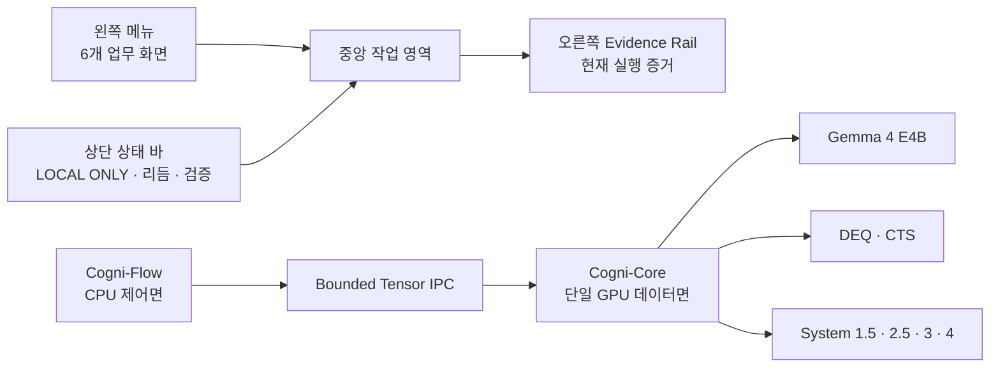

# CogniBoard 사용자 매뉴얼 및 운영 플레이북

- 제품: Cogni-OS 2.0 Genesis
- 화면: CogniBoard — Sovereign AI Mission Control
- 문서 기준 버전: 0.3.1
- 운영 원칙: 로컬 전용, 외부 API 호출 금지, 단일 GPU 소유권, 증거 기반 표시

## 1. 이 문서의 목적

CogniBoard는 단순한 채팅 화면이 아니라 로컬 Gemma 4 E4B, Cogni-Core,
검증 파이프라인, 제한된 로컬 도구, Self-Harness 연구 제어면을 한곳에서 운영하는
미션 컨트롤이다. 이 문서는 처음 실행하는 사용자, 데모 발표자, 검증 담당자,
개발 운영자가 같은 화면을 같은 의미로 해석하도록 돕는다.

가장 중요한 원칙은 **보이는 상태와 실제 권한을 구분하는 것**이다. 클래스가
존재하거나 카드에 모듈 이름이 보인다는 사실만으로 답변에 영향을 주거나 학습된
기능이라는 뜻은 아니다. CogniBoard는 `authoritative`, `canary`, `gated`,
`night_only`, `advisory`, `research`, `proposal_only` 상태를 구분한다.

## 2. 1분 빠른 시작

1. 배포 폴더에서 `CogniBoard-v0.3.1.exe`를 더블클릭한다.
2. 브라우저가 열리면 상단의 `LOCAL ONLY`, `외부 호출 0`, `리듬 INFERENCE`를
   확인한다.
3. `AI 워크스페이스`에서 “대한민국의 수도를 한 문장으로 알려줘.”처럼
   Fact-book과 무관한 일반 질문을 보낸다.
4. 답변 카드가 `Cogni Agent`이고 완료 배지가 일반 생성임을 확인한다.
5. “어떤 모델이고 어떤 기능을 할 수 있나요?”를 묻고 `Runtime Fact-book`,
   `FACT-BOOK · 검증된 사실` 배지를 확인한다.
6. `라이브 검증`으로 이동해 `검증 시작`을 누른다. 완료 전까지 오른쪽 증거 레일의
   `NOT VERIFIED`는 정상이다.
7. 검증이 모두 통과하면 `VERIFIED`, 실제 장치, VRAM, CTS depth, DEQ residual을
   확인한다.

### 실행 전 필수조건과 체크섬

- Windows 11 64-bit, Python 3.11 이상
- CUDA를 사용할 수 있는 로컬 PyTorch와 설치된 프로젝트 의존성
- `C:\Project\cognios\gemma4-e4b` 로컬 모델과 manifest 6개 파일
- EXE와 나란히 있는 `Cogni-OS-2-Genesis-source` 폴더
- 외부 다운로드가 필요 없는 완전한 로컬 실행 환경

배포 폴더에서 다음 PowerShell 명령으로 모든 최상위 artifact를 확인한다.

```powershell
Get-Content .\SHA256SUMS.txt
Get-ChildItem -File | ForEach-Object {
  $hash = (Get-FileHash -LiteralPath $_.FullName -Algorithm SHA256).Hash.ToLower()
  "${hash}  $($_.Name)"
}
```

한 글자라도 다르거나 EXE·source·매뉴얼 버전이 일치하지 않으면 **실행·시연·배포를
중지**하고 신뢰할 수 있는 commit에서 전체 번들을 다시 빌드한다.

## 3. 전체 화면 구조



### 상단 상태 바

- `LOCAL ONLY`: 애플리케이션 정책이 로컬 전용임을 뜻한다. 독립 패킷 감사가
  끝났다는 의미는 아니다.
- `외부 호출 0`: 현재 앱 계층에서 외부 API 호출이 없음을 표시한다.
- `리듬 INFERENCE`: 낮/추론 상태다. 야간 진화와 동시에 GPU를 소유하지 않는다.
- `검증 READY`: 라이브 검증 제어기가 대기 중이라는 뜻이다. 로컬 Gemma 모델이
  이미 VRAM에 상주했다는 뜻이 아니다.
- `3분 IR 모드`: 6개 화면을 발표 순서로 안내한다.
- 전체화면 버튼: 발표용 전체화면을 켜거나 끈다.
- 전원 버튼: 서버와 모델 워커를 정상 종료한다.

### 오른쪽 Evidence Rail

오른쪽 레일은 “주장”이 아니라 현재 프로세스가 보유한 증거를 보여준다.

- `NOT VERIFIED`: 이번 실행에서 라이브 검증이 아직 성공하지 않았다.
- `LIVE RUNNING`: 현재 검증 중이다.
- `VERIFIED`: 같은 실행에서 manifest, 모델, CTS/DEQ, 경계 검사가 모두 통과했다.
- `Model`, `Manifest`, `Runtime`: 실행 대상과 빌드 식별 정보다.
- `App external calls DISABLED`: 앱 외부 호출 경로가 비활성화됐다.
- `KV cache DISABLED`: 깊이별 KV cache 누적을 사용하지 않는다.
- `측정 환경`: 실제 검증이 끝나기 전에는 `실행 전 미측정`으로 표시된다.
- `메모리 주장 범위`: O(1) 주장은 고정 용량 CTS 작업 텐서 범위이며 전체 모델,
  로그, 외부 데이터까지 포함한 전 시스템 O(1) 주장이 아니다.

## 4. 왼쪽 메뉴와 각 페이지

### 4.1 AI 워크스페이스

목적은 로컬 AI와 대화하고 허용된 프로젝트 작업을 실행하는 것이다.

주요 영역:

- `로컬 AI 대화`: 사용자와 Cogni Agent의 대화 기록이다.
- `새 대화`: 현재 세션 기록을 비운다.
- `중단`: 현재 생성 또는 작업을 협력적으로 취소한다.
- 빠른 시작: 시스템 설명, 프로젝트 목록, 변경 상태, 작업 명령을 입력창에 넣는다.
- `대화`: 일반 자연어 질문과 설명 요청을 로컬 Gemma로 보낸다.
- `로컬 작업`: 명시적인 allowlist 명령만 실행한다.
- `인지 파이프라인`: 현재 요청에 참여하거나 대기 중인 Gemma, BIO-HAMA,
  System 3/4, DEQ/CTS, System 1.5/2.5의 상태를 보여준다.
- `작업 권한`: 읽기·쓰기·명령·소스 수정의 실제 경계를 보여준다.
- `자가 거울치료`: 실패 증거 수집과 제안 생성 상태를 보여준다. 현재 제품
  프로필은 `proposal_only`이며 활성 source를 자동 덮어쓰지 않는다.

응답 경로 구분:

| 화면 표시 | 의미 | 모델 생성 |
|---|---|---:|
| `Cogni Agent` | 일반 질문을 로컬 Gemma + Cogni-Core가 생성 | 있음 |
| `Runtime Fact-book` | 모델/파라미터/권한 같은 검증 사실을 스냅샷에서 응답 | 없음 |
| `시스템` | 실패, 정책 거부, 연결 상태 안내 | 없음 |
| `도구` | 허용된 로컬 작업 결과 | 없음 |

Fact-book 답변이 정상이라고 해서 모델 워커가 정상이라는 뜻은 아니다. 일반 질문이
실패하고 Fact-book만 답하면 오른쪽 레일과 시스템 메시지의 워커 초기화 원인을
확인한다.

### 4.2 미션 컨트롤

목적은 기술적 가치와 사업적 의미를 한 화면에서 설명하는 것이다.

- 주 메시지: 보안 데이터가 외부로 나가지 않는 온디바이스 AI 운영 체계.
- `실제 통합 검증 시작`: 라이브 검증 화면의 전체 파이프라인을 실행한다.
- `사업 가치 보기`: 시장·구매 논리 화면으로 이동한다.
- `검증된 실행 스냅샷`: 로컬 Gemma, CTS depth, DEQ equilibrium, C-FIRE 경계를
  시각화한다.
- 지표 카드: Peak VRAM, CTS depth, DEQ residual, 현재 회귀 증거를 보여준다.
- P-S-S-D Story: Problem, Solution, Scale-up, Moat의 사업 논리를 전환한다.

장치 카드의 `실측 장치`와 `목표 장치`를 혼동하지 않는다. 개발 PC의 측정값은
목표 RTX 4090 인증으로 자동 승격되지 않는다.

### 4.3 라이브 검증

목적은 같은 명령으로 모델 무결성부터 Depth 100 CTS까지 재현 가능한 검증을
수행하는 것이다.

실행 단계:

1. Artifact integrity — manifest와 SHA-256 확인
2. Local Gemma load — 로컬 파일만 사용해 모델 로드
3. Genesis runtime — 안전 경계와 런타임 조립
4. DEQ + CTS search — 고정 301-node arena에서 Depth 100 탐색
5. Safety postcheck — VRAM, finite, residual, fallback, 외부 호출 확인

`평형 탐색 코어` 그림은 검증 진행 상태를 표현하는 시각화이며 숨겨진
chain-of-thought를 노출하는 화면이 아니다. 안전 경계 카드에서 16.7GiB 이하,
spectral margin `< 0.95`, finite `PASS`, fallback `NOT USED`, external API
`BLOCKED/DISABLED`를 확인한다.

검증 시나리오 버튼은 검증 설명과 입력을 바꾸지만 증거 판정 기준을 낮추지 않는다.
취소하면 부분 결과는 `VERIFIED`로 승격되지 않는다.

### 4.4 시스템 설계

목적은 제어면과 GPU 데이터면이 어떻게 분리되는지 설명하는 것이다.

- `Cogni-Flow`: CPU 제어면. Bio Rhythm, BIO-HAMA, AFlow, Self-Harness를
  조정한다.
- `Bounded Tensor Boundary`: 문자열 자유형 프로토콜 대신 크기·dtype·timeout이
  고정된 텐서 경계를 사용한다.
- `Cogni-Core`: 단일 GPU 데이터면. Gemma 4, DEQ, CTS, Fast Weight,
  System 3/4, FP-EWC를 포함한다.
- `C-FIRE L < 0.95`: 적용 가능한 업데이트에 spectral safety projection을 건다.
- `Biological Rhythm`: Inference → Drain → Checkpoint → Evolution → Validate →
  Promote/Rollback 순서이며 추론과 진화를 동시에 실행하지 않는다.

상태 해석:

- `LOCAL/AUTHORITATIVE`: 검증된 로컬 백본 경로
- `READY/VERIFIED`: 소프트웨어 불변조건 또는 제어 경로 준비
- `CANARY`: 인과 연결은 있으나 학습·품질 승격 증거가 제한됨
- `GATED`: 학습 체크포인트와 품질 게이트 전에는 영향 금지
- `ADVISORY`: 자문 텐서만 제공하며 단독 권한 없음
- `NIGHT_ONLY`: 야간 진화 transaction에서만 허용
- `RESEARCH/PROPOSAL_ONLY`: 제품 source 자동 승격 권한 없음

### 4.5 사업 임팩트

목적은 누가 왜 구매하는지, 제품이 어떻게 반복 매출로 이어지는지를 설명하는
것이다.

- `바이오·신약 R&D`: 기밀 문서·코드·후보물질 IP를 외부로 보내지 않는 유상 PoC.
- `공공·국방 기술업무`: 폐쇄망 문서 지원과 비안전결정형 PoC. 안전 핵심 지휘
  판단은 제품 범위에서 제외한다.
- `금융·트레이딩`: 클라우드 왕복 없이 내부 텐서 경로로 연결하는 저지연
  의사결정 인프라 목표.
- 비교 표: 퍼블릭 클라우드, 사내 오픈소스 직접 구축, Cogni-OS의 통합·운영
  차이를 비교한다.
- J-curve: Appliance 일시 매출 → 연간 라이선스·유지보수 → 표준·IP 기반 확장.

`약 1,000대`, `6.3ms`, 비용 절감 배율은 목표 또는 사업계획이다. 라이브 실측
배지와 같은 의미로 발표하지 않는다.

### 4.6 증빙 · 로드맵

목적은 모든 핵심 주장을 증거 등급과 함께 공개하는 것이다.

증거 4등급:

| 등급 | 의미 | 예시 |
|---|---|---|
| 내부 실측 | 현재 장치에서 직접 측정 | Peak VRAM, depth, residual |
| 구성 검증 | 코드·테스트·정책 확인 | 회귀 테스트, 주·야간 배타 |
| 설계 목표 | 향후 공인시험 목표 | context 길이별 메모리 비교 |
| 사업계획 | 시장·예산·확장 계획 | SOM, 생산·라이선스 로드맵 |

이 페이지의 Evidence Ledger는 PASS/PENDING/RESEARCH를 한 목록에 표시한다.
로드맵은 검증 보호 → PoC 첫 제품 → 양산·라이선스 → 글로벌 표준 순서다. 초기
자금 배분, 특허, ISO/IEC 42001, 조달 계획은 기술 PASS가 아니라 별도 사업
증거다.

## 5. 대화 모드 사용법

일반 질문 예시:

- “이 문단을 세 문장으로 요약해줘.”
- “파이썬에서 안정적인 재시도 함수를 작성하는 방법을 설명해줘.”
- “대한민국의 수도를 한 문장으로 알려줘.”
- “방금 답변의 핵심 가정 세 가지를 구분해줘.”

좋은 요청은 원하는 결과 형식, 길이, 근거 범위를 함께 말한다. 답변이
`길이 한계 · 이어서 가능`으로 끝났을 때만 “계속 이어서 답해주세요.”를 사용한다.
같은 질문을 여러 번 전송하지 않는다.

정체성·파라미터·모듈 권한 질문은 Runtime Fact-book이 담당한다. 이는
할루시네이션을 줄이기 위한 의도적인 경로이며 일반 지식 질문을 하드코딩한다는
뜻이 아니다.

## 6. 로컬 작업 모드

작업 모드는 자유형 셸이 아니라 고정 명령만 받는다.

```text
/help
/list [path]
/read <file>
/search <query> [--in <path>]
/status
/test          # 신뢰 개발자 opt-in에서만
/save <name>   # outputs/agent-workspace 아래 결과 저장
```

- 읽기는 프로젝트 루트 안으로 제한된다.
- 쓰기는 `outputs/agent-workspace` 아래로 제한된다.
- 경로 탈출, 심볼릭 링크 우회, 임의 셸, 네트워크, 검증 전 source 덮어쓰기는
  거부된다.
- `/test`는 제품 기본값에서 차단되며 OS 수준 격리 증거가 있는 신뢰 개발
  환경에서만 명시적으로 활성화한다.

## 7. Self-Harness 자가 거울치료

자가 거울치료는 의학적 심리치료가 아니라 소프트웨어 실패를 다시 관찰하고
안전한 개선 제안으로 만드는 연구 워크플로다.

1. 성공·실패·timeout·quality rejection을 bounded journal에 기록한다.
2. 동일 원인의 증거를 군집화한다.
3. 최소 K개 독립 증거가 있는 후보만 제안한다.
4. 후보는 격리된 제안·회귀 검증 경로로 보낸다.
5. 현재 v0.3.1 제품은 결과를 `proposal_only`로 보존한다.

현재 활성 source 자동 덮어쓰기, 임의 코드 실행, 무인 승격은 지원하지 않는다.
이 경계는 미완성 UI가 아니라 증명되지 않은 자가수정의 위험을 막는 안전 정책이다.

## 8. 3분 IR 발표 플레이북

### 0:00–0:30 — 문제

미션 컨트롤에서 “민감 데이터는 외부로 나갈 수 없고, 직접 구축은 보안·최적화·
운영 비용이 크다”는 문제를 설명한다.

### 0:30–1:10 — 실제 제품

AI 워크스페이스에서 일반 질문 한 개와 Fact-book 질문 한 개를 시연한다. 두
응답 배지가 다르다는 점이 신뢰 설계의 핵심이다.

### 1:10–1:50 — 검증

라이브 검증에서 manifest, 모델 로드, Depth 100, 301-node arena, 16.7GiB 경계를
보여준다. 개발 장치와 목표 RTX 4090을 구분해 말한다.

### 1:50–2:25 — 방어력

시스템 설계에서 CPU 제어면/단일 GPU 데이터면, 주·야간 배타, C-FIRE,
proposal-only Self-Harness를 설명한다.

### 2:25–3:00 — 사업화

사업 임팩트와 증빙·로드맵에서 유상 PoC → Appliance → 연간 라이선스 → 표준·IP
확장 순서를 제시하고 목표 수치를 실측처럼 말하지 않는다.

## 9. 장애 대응

### Fact-book은 답하지만 다른 질문은 실패

의미: 웹 UI와 Fact-book은 살아 있지만 로컬 모델 워커가 초기화되지 않았다.

확인 순서:

1. 시스템 메시지의 구체적인 초기화 단계를 확인한다.
2. `CTS policy checkpoint integrity verification failed`이면 배포 ZIP/소스가
   v0.3.1인지와 `SHA256SUMS.txt`를 확인한다.
3. 모델 경로 `C:\Project\cognios\gemma4-e4b`와 manifest 6개 파일을 확인한다.
4. Python, PyTorch, Transformers, CUDA, GPU 여유 메모리를 확인한다.
5. 배포 폴더의 source와 EXE가 같은 버전인지 확인한다.

### `NOT VERIFIED`가 계속 보임

라이브 검증을 실행하지 않았거나 현재 실행에서 검증이 실패·취소된 상태다.
이전 실행의 성공값은 새 프로세스에 자동 이식되지 않는다.

### `COMPUTE BUSY`

검증, 대화, 야간 진화 중 하나가 GPU를 소유하고 있다. 현재 작업을 완료하거나
정상 중단한 뒤 다시 시도한다.

### 답변이 길이 한계로 끝남

`길이 한계 · 이어서 가능` 배지가 있을 때만 이어쓰기를 요청한다. 문장 중간에서
아무 배지 없이 끝나면 실행 이벤트와 quality 경계를 확인한다.

### 연결이 끊김

창을 연속 새로고침하지 말고 상태가 복구되는지 기다린다. 복구되지 않으면 전원
버튼으로 종료 후 EXE를 다시 실행하고, 계속 실패하면 CLI 진단을 사용한다.

### 오류 코드별 운영 표

| 증상/코드 | 의미 | 즉시 조치 | 보존할 증거 | 재개 조건 |
|---|---|---|---|---|
| `AGENT_UNAVAILABLE` | Agent 제어면 미구성 | 중복 실행을 멈추고 정상 재시작 | 시스템 메시지, 빌드 버전 | Agent 상태가 STANDBY/READY |
| `AUTH_REQUIRED` | 로컬 세션 인증 만료 | 전원 종료 후 EXE 재실행 | session 시각, 오류 코드 | 새 세션 인증 성공 |
| `COMPUTE_BUSY` | 대화·검증·진화가 GPU lease 소유 | 반복 클릭 금지, 완료 대기 또는 해당 작업 중단 | active job, rhythm, lease | active job 0 |
| `CONNECTION_LOST` | UI와 loopback 서버 연결 단절 | 자동 복구 대기, 연속 새로고침 금지 | 시각, 마지막 이벤트 | 연결 복구 알림 |
| 체크포인트 무결성 | 배포 byte와 신뢰 SHA 불일치 | 즉시 실행 중지 | ZIP/파일 SHA-256, commit OID | v0.3.1 번들 재검증 |
| VRAM/OOM | 16.7GiB 경계 또는 여유 메모리 실패 | 다른 GPU 프로세스 종료 후 재시험 | 장치, peak VRAM, 프로세스 목록 | 경계 PASS |
| finite/residual/fallback 실패 | DEQ/CTS 안전 postcheck 실패 | VERIFIED 선언 금지 | 원시 이벤트와 terminal metrics | 전체 라이브 검증 PASS |
| 반복·미완성 답변 | 품질 경계 또는 생성 실패 | 중단하고 같은 질문 연타 금지 | prompt, answer, finish/quality reason | 새 회귀·일반질문 smoke PASS |
| Self-Harness 무결성 제외 | 제안 증거가 불완전 | 승격 금지 상태 유지 | ledger, blocked reason | reviewable proposal 증거 |

## 10. 데모 전 체크리스트

- [ ] EXE, wheel, source ZIP, 매뉴얼의 SHA-256 확인
- [ ] 로컬 모델 경로와 manifest 일치
- [ ] 일반 질문 1개가 `Cogni Agent` 경로로 완료
- [ ] 정체성 질문 1개가 `Runtime Fact-book` 경로로 완료
- [ ] 같은 답변의 반복 루프 없음
- [ ] 답변이 완전한 문장으로 종료
- [ ] 라이브 검증 전체 PASS
- [ ] 실제 장치와 목표 장치를 구분
- [ ] Self-Harness를 자동 source 수정이라고 과장하지 않음
- [ ] 사업계획 수치와 실측 수치를 구분
- [ ] 종료 시 전원 버튼 사용

### 데모 진행 중

- [ ] 일반 생성과 Fact-book 배지 차이를 직접 보여준다.
- [ ] 실제 측정 장치와 목표 RTX 4090을 구분한다.
- [ ] 검증 전 숫자를 과거 성공값으로 채우지 않는다.
- [ ] System 1.5 gated, System 3/4 advisory, AFlow research,
  Self-Harness proposal_only를 정확히 말한다.
- [ ] 1,000대·6.3ms·비용효과는 사업계획/목표로 표시한다.

### 데모 종료 후

- [ ] 실행 이벤트, 증거 JSON, 화면 캡처, version, device, timestamp를 보존한다.
- [ ] worker cleanup과 GPU lease release를 확인한다.
- [ ] 전원 버튼으로 서버를 종료한다.

발표 금지 표현: “RTX 4090 인증 완료”, “전체 시스템 O(1)”, “모든 System 모듈이
학습되어 답변 향상”, “자동 source 수정·무인 승격”, “독립 packet audit 완료”,
“AGI·무한 진화 완성”.

## 11. 단축키

- `Ctrl+Enter` 또는 `Cmd+Enter`: 메시지 전송
- `Alt+1`~`Alt+6`: 왼쪽 6개 화면 전환
- `Esc`: 3분 IR 가이드 또는 모달 닫기
- 전체화면 버튼: 발표 전체화면 전환

## 12. 완료 판정

CogniBoard가 “완료”라고 말할 수 있는 최소 조건은 다음과 같다.

1. 정확한 배포본에서 체크포인트·manifest 무결성이 통과한다.
2. 일반 질문이 실제 Gemma/Cogni-Core 경로로 자연스럽게 한 번만 답한다.
3. Fact-book 질문은 검증 사실만 말하고 모델 생성과 명확히 구분된다.
4. 반복·역할 누출·미완성 문장·허위 완료가 품질 게이트를 통과하지 않는다.
5. 라이브 검증의 VRAM·CTS·DEQ·finite·fallback 경계가 모두 통과한다.
6. 로컬 작업과 Self-Harness가 문서화된 권한을 넘지 않는다.
7. 최종 artifact와 체크섬이 같은 source tree에서 재현된다.

이 조건은 현재 소프트웨어 범위의 완료 판정이다. AGI, 무한 자기개선, 전체 시스템
O(1) 메모리, 목표 RTX 4090 공인 인증, 학습되지 않은 연구 모듈의 품질 향상까지
증명했다는 뜻은 아니다.
